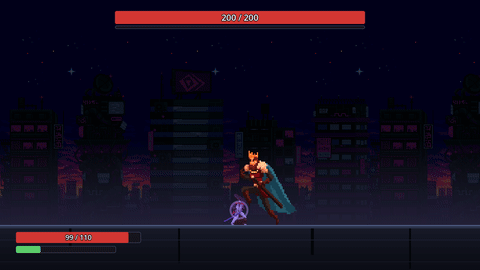

# OVERFIT

[English](README.md)

OVERFIT 은 보스전 하나를 싸우는 2D 횡스크롤 소울라이크입니다. 보스는 공격마다 계획을 통째로 세웁니다 — 얼마나 쉴지, 달려들지,
어느 동작으로 열지, 그 동작을 끊고 다른 동작으로 이을지. 이 버전의 보스는 계획을 무작위로 고릅니다. 다음 버전들에서 플레이어의
회피 습관을 읽고 그 습관을 노리는 계획을 세웁니다.

목적은 플레이어의 회피 습관에 맞춰 계획을 바꾸는 보스가 공정하고 재미있는지 확인하는 것입니다. 이 버전은 그 보스가 쓸 동작 · 캔슬 ·
달리기를 만듭니다.

## 보스전

- 보스 하나, 체력 1000 입니다. 파이터는 체력 220 · 목숨 하나입니다. 10분을 넘기면 집니다.
- 파이터는 대시(짧은 무적) · 점프 · 가드(스태미나를 씁니다) · 패리 · 공격(한 번 또는 2연격)을 합니다.
- 알맞은 순간의 패리는 보스의 동작을 끊고 보스를 1.5초 탈진시킵니다. 칼이 닿으면 보스의 경직 게이지도 차고, 게이지가 가득 차면 똑같이
  탈진합니다.

## 동작

동작은 일곱입니다. 틱은 1/60초이고 동작이 선 틱부터 셉니다. 판정은 8틱 동안 삽니다.

| 동작 | 판정(틱) | 피해 | 피하는 법 | 설명 |
|---|---|---|---|---|
| 3연격 | 51 · 93 · 159 | 8 · 8 · 14 | 대시 · 가드 · 패리 | 1타는 때맞춘 점프로 넘습니다. 캔슬 지점 78 · 144 |
| 엇박 3연격 | 60 · 111 · 186 | 8 · 8 · 14 | 대시 · 가드 · 패리 | 3연격과 같은 칼인데 칼을 들고 0.15초씩 더 멈춥니다. 박자로 패리하는 사람을 잡습니다. 캔슬 지점 87 · 162 |
| 빠른 3연격 | 24 · 51 · 84 | 8 · 8 · 14 | 대시 · 가드 · 패리 | 1타가 0.4초에 옵니다. 앞 동작이 끝나자마자 2연격을 시작한 사람을 잡습니다. 캔슬 지점 36 · 69 |
| 돌진 | 도착 뒤 24 | 14 | 대시 · 가드 · 패리 | 3600 px/s 로 파이터 앞 280 까지 달려와 칩니다 |
| 잡기 | 36 | 25 · 1초 붙듦 | 점프만 | 흰 구가 0.6초 동안 파이터에게 날아옵니다 |
| 점프 공격 | 60 | 24 | 점프만 | 한 번 뛰고, 착지가 바닥 전체를 칩니다. 대시 무적 · 가드 · 패리로는 못 받습니다 |
| 올려베기 | 51 | 14 | 대시 · 가드 · 패리 | 3연격 1타와 같은 박자인데 높이 칩니다. 3연격을 넘으려고 미리 뛴 사람이 맞습니다 |

|  |  |
|---|---|
| **3연격 → 돌진** | **3연격 → 잡기** |
|  |  |
| **엇박 3연격** | **점프 공격** |

GIF 는 이 버전 전에 고정된 대본으로 찍었습니다. 앞의 둘은 옛 `1타 돌진` · `1타 잡기` 패턴인데, 지금은 3연격을 1타 뒤에 끊고 잇는 캔슬과
같은 흐름입니다. 마지막은 세 번 뛰던 옛 점프 공격입니다.

## 계획

```
쉬기(제자리 · 파이터 쪽으로 돌아서기만) → [달리기] → 첫 동작 → [캔슬] → 잇는 동작 → 다음 계획
```

- **쉬기.** 0.4 · 0.8 · 1.2초 중 하나입니다. 쉬는 길이는 뒤의 동작과 짝입니다 — 짧게 쉬면 앞 동작의 후딜에 누른 2연격을 빠른 3연격이
  잡고, 길게 쉬면 아무것도 못 잡습니다.
- **달리기.** 계획이 달리기를 골랐으면 쉬기 뒤에 840 px/s(파이터 걸음의 두 배)로 파이터 앞 280 까지 달려가 닿는 틱에 첫 동작을
  세웁니다. 매 틱 파이터 쪽으로 돌아섭니다. 이미 280 안이면 안 달립니다. 3초를 넘기면 그 자리에서 멈춥니다. 쉬는 동안 보스는 제자리입니다.
- **캔슬.** 3연격 계열 셋은 다음 타의 선딜이 서는 시각에 캔슬 지점이 있습니다. 캔슬 지점에서 보스는 하던 동작을 버리고, 파이터 쪽으로
  돌아서서, 쉬지 않고 같은 틱에 잇는 동작을 세웁니다. 계획 하나에 캔슬 한 번이고, 잇는 동작은 끝까지 갑니다. 보스가 탈진하면 계획이
  끝나고 캔슬도 버립니다.
- **무작위 고르기.** 결정마다(첫 동작 · 쉬기 · 달리기 · 끊나 · 어디서 · 무엇으로) 제 난수 스트림을 씁니다(`overfit/core/Det.cs`). 그래서
  같은 시드면 같은 보스입니다. 3연격 계열의 절반을 끊고 계획의 절반이 달립니다(`overfit/data/balance.json` 의 `picker`).
- **데이터만으로.** `overfit/data/patterns.json` 과 `stages.json` 의 명부에 동작을 더하면 첫 동작으로도, 모든 캔슬 지점의 잇는 동작으로도
  나옵니다. 코드는 안 엽니다. 동작에 캔슬 지점을 더하면 그 동작의 계획에 캔슬이 하나 늡니다.

## 되살리기

끝난 시도마다 `user://attempts/<세션 시드>.jsonl` 에 JSON 한 줄을 남깁니다: 계획들, 입력(같은 입력이 이어지는 틱을 한 칸으로 접습니다 —
가장 긴 판이 약 27KB), 회피 관측, 게임 데이터의 지문. 기록은 어디로도 보내지 않습니다.

- `EXTRA="--history=<파일> --attempt=N" tools/build.sh demo` 는 저장한 입력으로 그 시도를 통째로 되살려 계획 · 길이 · 결과 · 관측
  전부를 기록과 견줍니다. 같으면 `replay_match`, 다르면 `[E] replay_mismatch`(결정론이 깨졌습니다), 그 사이 게임 데이터가 바뀌었으면
  `[W] replay_data_changed` 를 남깁니다.
- 이전 버전이 남긴 줄에는 입력이 없어 되살릴 수 없습니다(`[E] replay_no_inputs`).
- 결과 화면은 보스가 어떻게 계획했는지 보여 줍니다: 계획 수와 캔슬 수, 이 판의 회피, 동작마다 몇 번 나와 몇 번 맞았는지, 캔슬한 짝마다
  몇 번인지.

## 습관을 읽는 보스

0.9 버전(태그 [`v0.9.2`](https://github.com/Atralupus/OVERFIT/tree/v0.9.2))에는 1단계의 회피를 읽고 2단계 패턴마다 맞을 확률을
예측하는 신경망이 있었습니다. 이 버전의 동작 재편과 함께 걷었습니다 — 출력이 옛 패턴에 묶여 있었습니다. 최근 흐름과 쌓인 습관으로 계획을
세우는 새 망은 [설계](docs/superpowers/specs/2026-09-29-똑똑한-보스-design.md)의 조각 4 에서 들어옵니다.

## 어디에 있나

| 부분 | 위치 |
|---|---|
| 동작 · 캔슬 지점 | `overfit/data/patterns.json` |
| 보스 수치(쉬기 · 달리기) | `overfit/data/bosses.json` |
| 고르기 수치 | `overfit/data/balance.json` (`picker`) |
| 계획 · 캔슬 | `overfit/battle/rules/BossPlan.cs`, `PatternPickers.cs`, `PlanFlow.cs`, `BattleSim.cs` |
| 달리기 | `overfit/battle/rules/BattleSim.cs`, `RushMotion.cs` |
| 시도 기록 · 되살리기 | `overfit/battle/rules/AttemptLog.cs`, `InputTape.cs`, `Replay.cs`, `overfit/battle/debug/BattleDemo.cs` |
| 봇 함대 · 데이터 공장 | `overfit/battle/rules/FleetBot.cs`, `BotTraits.cs`, `tools/factory/` |

## 플레이

macOS 빌드는 [Releases](https://github.com/Atralupus/OVERFIT/releases/latest) 에 있습니다. 서명하지 않은 빌드입니다.
macOS 가 막으면 시스템 설정 → 개인정보 보호 및 보안에서 "그래도 열기"를 누르면 됩니다.

| 행동 | 키 |
|---|---|
| 이동 | ← → (A D) |
| 점프 | Space |
| 대시 | Shift |
| 공격 | J (다시 누르면 2연격) |
| 가드 | ↓ (S), 누르고 있는 동안 |
| 패리 | K |

소스에서 빌드하려면 Godot 4.7(mono)과 .NET 8 이 필요합니다. 방법은 [CONTRIBUTING.md](CONTRIBUTING.md) 에 있습니다.

| 명령 | 하는 일 |
|---|---|
| `tools/build.sh check` | 포맷 · 빌드 · 규칙 테스트 · `.uid` 짝 · 판정 모양. 커밋 전 게이트입니다 |
| `tools/build.sh smoke` | 창 없이 부팅하고 씬을 돕니다 |
| `tools/build.sh demo [시드]` | 창 없이 봇이 한 판을 싸웁니다 |
| `tools/build.sh factory` | 봇 함대가 보스와 싸워 표본을 짓습니다 |
| `tools/build.sh shots` | 스크린샷을 찍습니다 |
| `tools/build.sh export` | macOS 빌드를 만듭니다 |

## 라이선스

코드는 [MIT](LICENSE) 입니다. 그림은 CC0 팩 세 개를 쓰며, 저장소에는 들어 있지 않습니다. 목록은 게임 안 크레딧 화면과
[`overfit/data/credits.json`](overfit/data/credits.json) 에 있습니다.
