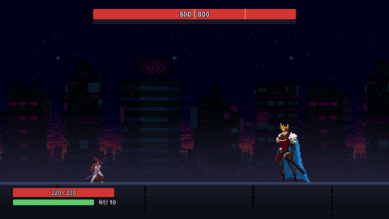

# OVERFIT

[English](README.md)

OVERFIT 은 보스전 하나를 싸우는 2D 횡스크롤 액션 게임입니다. 보스는 페이즈가 셋이고, 페이즈마다 학습 정도가 다른 보스입니다. 강화학습으로
학습한 신경망이 보스가 하는 일을 모두 고르고, 페이즈가 오를수록 더 오래 학습한 망을 씁니다. 보스는 싸우는 동안 플레이어를 배우지 않습니다.
게임이 나오기 전에 학습을 마친 보스입니다.

- 보스 체력은 800 입니다. 600 에서 2페이즈, 400 에서 3페이즈가 시작됩니다.
- 페이즈가 바뀔 때 보스는 멈춰 서서 희게 세 번 번쩍이고, 1.5초 동안 피해를 받지 않습니다.

## 세 보스

|  |  |
|---|---|
| **1페이즈.** 달려들어 빠른 3연격과 돌진으로 엽니다 | **2페이즈.** 거리를 두다가 파이터를 넘어 뛰어 등 뒤에서 칩니다 |
|  |  |
| **3페이즈.** 물러서고 파이터 주위를 뛰어다니며 빈틈을 기다립니다 | **페이즈 전환.** 보스가 멈춰 서서 희게 세 번 번쩍이고, 1.5초 동안 피해를 받지 않습니다 |

## 보스의 동작

|  |  |
|---|---|
| **3연격 → 돌진.** 1타 뒤에 끊고 잇습니다 | **3연격 → 잡기.** 2타 뒤에 끊고 잇습니다 |
|  |  |
| **점프 공격.** 착지는 점프로만 넘습니다 | **올려베기.** 높이 닿아서 점프로는 못 넘습니다 |
|  |  |
| **빠른 3연격** | **엇박 3연격.** 타마다 선딜을 조금 더 끕니다 |
|  |  |
| **물러서기.** 파이터를 본 채 뒤로 달립니다 | **점프 이동.** 파이터를 넘어 뛰고, 이어서 파이터에게서 멀리 뒤로 뜁니다 |

틱은 1/60초이고, 동작이 선 틱부터 셉니다.

| 동작 | 판정(틱) | 피해 | 피하는 법 | 끝(틱) |
|---|---|---|---|---|
| 3연격 | 51 · 93 · 159 | 8 · 8 · 14 | 대시 · 가드 · 거리. 몇 타는 점프로 넘습니다 | 213 |
| 엇박 3연격 | 60 · 111 · 186 | 8 · 8 · 14 | 대시 · 가드 · 거리. 몇 타는 점프로 넘습니다 | 240 |
| 빠른 3연격 | 24 · 51 · 84 | 8 · 8 · 14 | 대시 · 가드 · 거리 | 138 |
| 돌진 | 닿은 뒤 24 | 14 | 대시 · 가드 | 닿은 뒤 78 |
| 잡기 | 60 | 25, 1초 붙듦 | 점프만 | 158 (헛치면 보스가 1.5초 빈틈) |
| 점프 공격 | 60 | 24 | 점프만 | 108 |
| 올려베기 | 51 | 14 | 대시 · 가드 | 105 |

3연격 셋에는 캔슬 지점이 있습니다. 보스는 캔슬 지점에서 남은 연격을 버리고 곧장 다른 동작을 시작할 수 있습니다.

## 보스전

- 파이터는 체력 220 · 목숨 하나입니다. 10분을 넘기면 집니다.
- 파이터는 이동 · 점프 · 대시(짧은 무적) · 가드(스태미나를 씁니다) · 공격(한 번 또는 2연격) · 폭탄 던지기를 합니다.
- **폭탄.** 한 판에 10개입니다. 던지는 데 1.5초가 걸리고, 놓기 전에 맞으면 폭탄을 잃습니다. 떨어진 폭탄의 피해는 60 입니다.
- 칼이 닿으면 보스의 경직 게이지가 찹니다. 게이지가 가득 차면 보스가 1.5초 탈진합니다.

## 보스를 학습시킨 방법

**보스가 보는 것과 고르는 것.** 결정 지점(자유로워진 순간, 기다리거나 달려드는 동안 0.2초마다, 캔슬 지점마다)에서 게임은 판을 숫자 95 개로
바꿉니다. 보스의 자리 · 체력 · 페이즈 · 지금 동작, 0.3초 전 파이터의 자리 · 체력 · 스태미나 · 폭탄 · 최근 행동, 날아가는 폭탄입니다. 작은 망
(95 → 128 → 128 → 13)이 선택지 13 개마다 점수를 냅니다. 기다리기 · 달려들기 · 물러서기 · 넘어 뛰기 · 뒤로 뛰기 · 지금 동작 이어 가기 · 동작
일곱 중 하나 시작하기입니다. 지금 할 수 없는 선택지는 빼고 남은 선택지에서 무작위로 고르되, 점수가 높을수록 잘 뽑힙니다.

**배우는 방법.** 보스는 판을 많이 싸우며 결정마다 보상을 받습니다. 준 피해는 더하고, 받은 피해는 빼고, 시간은 조금 빼고, 한 판에서 어느 동작을
처음 쓰면 작은 보상을 더하고(그래서 모든 페이즈가 일곱 동작을 다 씁니다), 이기면 +1 · 지면 −1 입니다. 학습 방법(PPO)은 보상이 많았던
선택지를 더 잘 뽑히게 바꿉니다.

**학습 상대.** 파이터를 하는 망을 하나 더 두고, 둘을 게임의 규칙 그대로 20 라운드 번갈아 학습시켰습니다(셀프 플레이). 라운드마다 저장한
보스를 같은 상대 묶음(봇 · 저장한 파이터들)과 견줬더니 승률이 22%(안 배움)에서 89%(라운드 20)까지 올랐습니다.

**세 페이즈 고르기.** 3페이즈는 가장 센 저장본(라운드 20 · 89%)입니다. 1 · 2페이즈는 안 배운 보스에서 3페이즈까지의 절반 · 4분의 3 자리에
가장 가까운 저장본(라운드 10 · 63%, 라운드 16 · 71%)입니다. 일곱 동작을 모두 쓰는 저장본만 고릅니다.

**결론적으로 파이터가 이깁니다.** 마지막에 학습한 파이터는 3페이즈 보스를 256 판 중 61% 이깁니다.

## 게임 안에서 도는 방식

- 망은 `overfit/data/boss_net/form1.json` · `form2.json` · `form3.json` 이고, 페이즈가 바뀔 때 다음 망으로 바뀝니다.
- 무작위 고르기는 게임의 시드 난수와 덧셈 · 곱셈만으로 세는 지수 함수를 씁니다. 그래서 기록한 시도는 어느 기기에서든 똑같이 되살아납니다.
  테스트가 게임의 결과를 파이썬과 비트까지 견줍니다.

## 다른 보스와 견주기

같은 상대들(봇 · 저장한 파이터들)과 같은 시드로 보스마다 512 판씩 견줬습니다(`tools/build.sh gate --name=sp-4`, 결과는
[`ml/rl/gate/sp-4.json`](ml/rl/gate/sp-4.json)).

| 보스 | 승률 |
|---|---|
| 무작위 선택 | 21% |
| 손으로 짠 규칙(망 이전의 보스) | 23% |
| 표(신경망 없는 강화학습) | 55% |
| 1 · 2 · 3페이즈 망, 판 내내 | 65% · 73% · 89% |
| 게임의 보스(1 → 2 → 3페이즈) | 78% |

## 플레이

macOS 빌드는 [Releases](https://github.com/Atralupus/OVERFIT/releases/latest) 에 있습니다. 서명하지 않은 빌드입니다.
macOS 가 막으면 시스템 설정 → 개인정보 보호 및 보안에서 "그래도 열기"를 누르면 됩니다.

| 행동 | 키 |
|---|---|
| 이동 | ← → (A D) |
| 점프 | Space |
| 대시 | Shift |
| 공격 | J (다시 누르면 2연격) |
| 가드 | ↓ (S), 누르고 있는 동안 |
| 폭탄 | L |

소스에서 빌드하려면 Godot 4.7(mono)과 .NET 8 이 필요합니다. 방법은 [CONTRIBUTING.md](CONTRIBUTING.md) 에 있습니다.

| 명령 | 하는 일 |
|---|---|
| `tools/build.sh check` | 포맷 · 빌드 · 테스트. 커밋 전 게이트입니다 |
| `tools/build.sh export` | macOS 빌드를 만듭니다 |
| `tools/build.sh selfplay --name=이름` | 보스 망과 파이터 망을 번갈아 학습합니다. `ml/.venv` 가 필요합니다(`ml/requirements.txt`) |
| `tools/build.sh evalboss --name=이름` · `pick --name=이름` | 저장한 보스를 모두 견주고 세 페이즈를 고릅니다 |
| `tools/build.sh duel 파이터망.json` | 학습한 파이터와 게임의 보스가 한 판을 끝까지 싸우는 영상을 찍습니다 |

## 라이선스

코드는 [MIT](LICENSE) 입니다. 그림은 CC0 팩 세 개를 쓰며, 저장소에는 들어 있지 않습니다. 목록은 게임 안 크레딧 화면과
[`overfit/data/credits.json`](overfit/data/credits.json) 에 있습니다.
