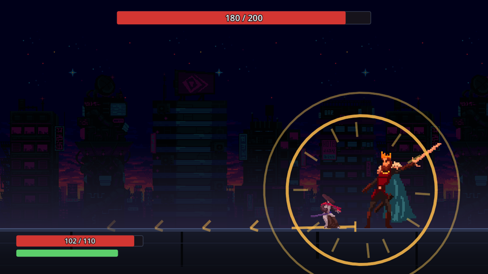
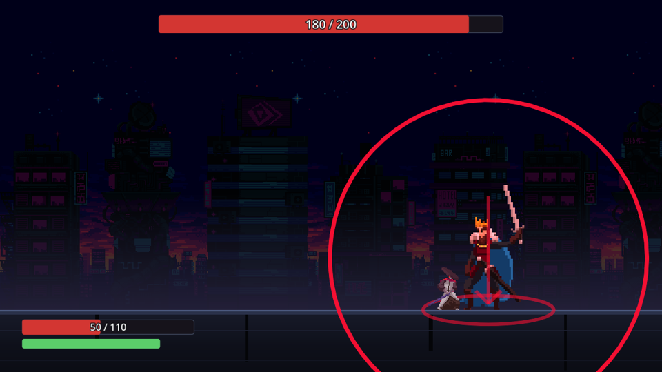
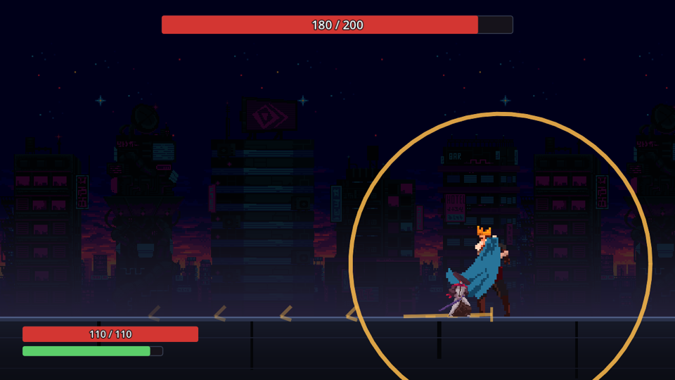
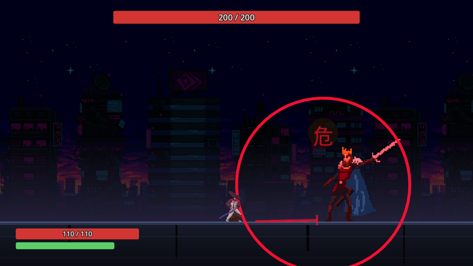
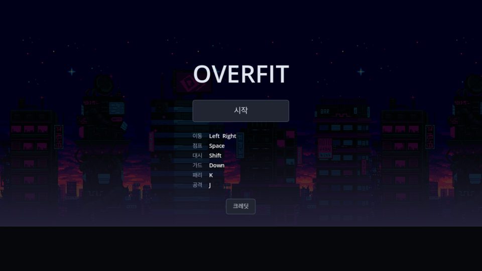
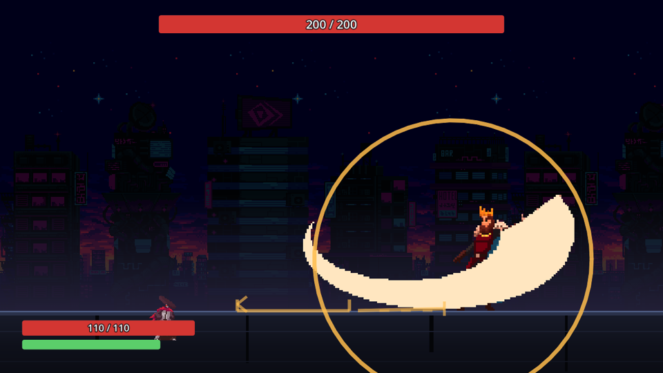
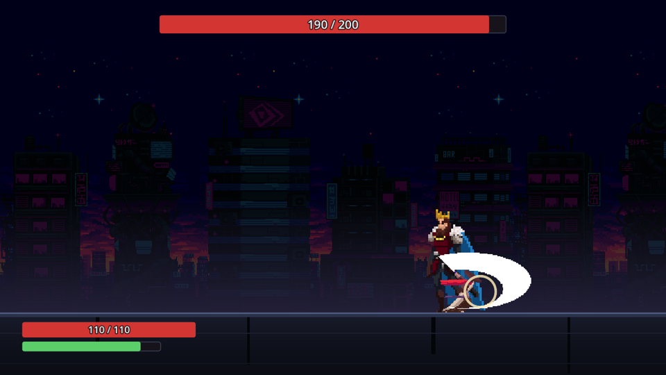
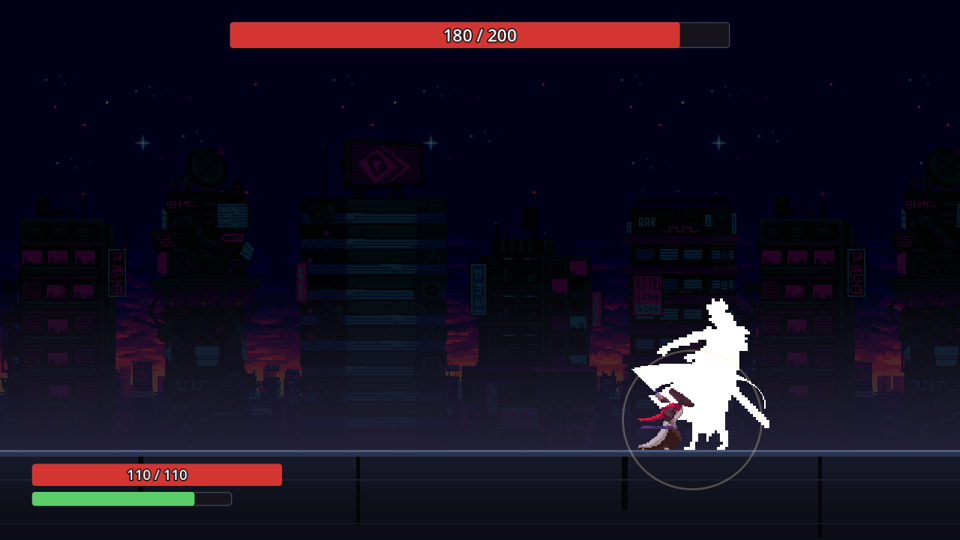
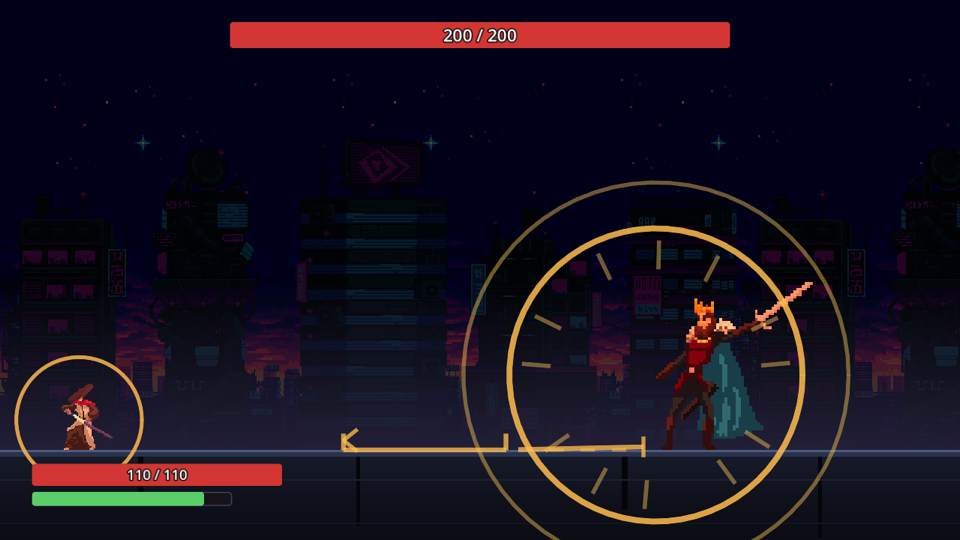
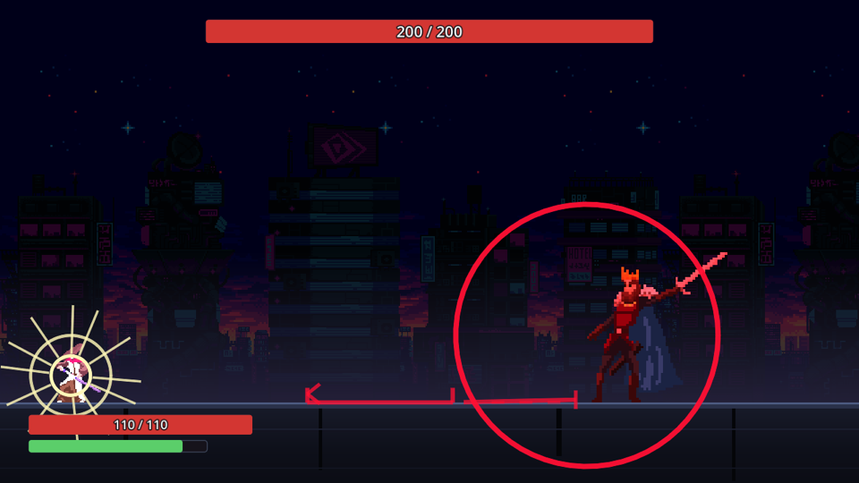

# OVERFIT

**딥러닝을 소울라이크에 접목해 보고, 그게 재미있는지 확인하는 프로젝트다.**

확인하려는 것은 하나다 — **플레이어가 지금까지 어떻게 피해 왔는지를 읽고 공격 패턴이 정해지는 보스**가
상대할 만한가. 재미있는가.

> ### 🚧 아직 개발 중이다
>
> 전투 한 판은 처음부터 끝까지 돌아간다. 하지만 이 프로젝트의 핵심인 **패턴을 고르는 망은 아직 없다** —
> 지금은 무작위로 고른다. 일부러 그렇게 뒀고, 이유는 [아래](#어떤-망을-어떻게-만드나)에 적었다.

---

## 무슨 게임인가

평평한 보스방 하나에서 보스 하나를 잡는 **2D 가로 소울라이크**다. 세 단계를 넘으며 보스가 조금씩 달라진다.

보스는 [나인 솔즈](https://ninesols.wiki.gg/)의 튜토리얼 보스 **백장**을 참고했다. 느리고 예측
가능해서, **패리와 대시를 가르치기 위해 설계된 상대**다.

**기술은 하나다 — 내려찍기 3연타.** 늘어나는 것은 종류가 아니라 **변종**이고, 변종은 당신이
기대는 답을 하나씩 막는다. 딥러닝이 고를 것이 바로 이 변종이라, 프로토타입은 계열 하나로 먼저 세운다.

| | 무엇을 막나 |
|---|---|
| **1단계 — 내려찍기 I** | 아무것도 안 막는다. 네 답이 다 쓰인다 — 가드는 호박 두 대까지고 빨간 마무리는 받아치거나 피한다. 당신이 무엇에 기대는지를 **재는** 단계다 |
| **II·III-끌기** | **대시.** 마무리를 밖으로 한 대시의 착지점에 세운다. 붙어 있으면 안 맞는다 |
| **II·III-쇄도** | **간격.** 마무리의 사거리가 도주로를 덮는다. 붙어 싸우면 아무 차이도 없다 |
| **II-쐐기** | **가드.** 빨간 넷째가 26 으로 무겁다 — 붙든 가드는 거기서 깨지고 다른 변종(14)의 두 배 가까이를 문다 |
| **III-쐐기** | **가드.** 셋째가 무거워(32) 붙든 가드의 스태미나가 빨간 마무리 **전에** 바닥난다 — 무너진 채로 빨강을 맞는다. 붙들지 않는 사람에게는 2단계와 한 틱도 안 다르다 |
| **III-역린** | **패리.** 판정 없는 헛스윙이 하나 섞인다 — 거기 지르면 다음 패리 창이 좁아진다 |
| **III-역습** | **욕심.** 2타 뒤의 0.90초는 칼 한 번이 정확히 들어가는 미끼다. 이 변종만 거기에 판정을 끼운다 |

원칙은 하나다 — **저격 대상이 아닌 사람에겐 1단계와 같은 난이도여야 한다.** 봉인이지 벌이 아니다.

몸은 서로 통과한다. 밀어내지 않으니 갇히지 않고, 대신 "거리"는 벽이 아니라 **패턴의 안전 구역**이 만든다.

**조작** — 이동 `←` `→` (또는 `A` `D`) · 점프 `Space` · 대시 `Shift` · 패리 `K` · 공격 `J`(길게 누르면 차지)

공격은 **누르고 있으면 모인다.** 0.8초에 두 배, 2초에 세 배. 모으는 동안에는 걷지도 뛰지도 못하고
맞으면 모은 것이 전부 날아간다. **붙들고 있는 시간이 곧 선딜이라** 놓으면 칼이 곧장 나가고,
그래서 최대 차지는 칼이 닿기까지 2.08초다 — 보스의 빈 시간(2.25초)에 그냥 선 채로 들어간다.

안 들어가는 것은 앞 변종이 `III-역습` 일 때뿐이다(2.00초). 욕심을 벌하는 변종 뒤에 2초를 모으는 것이
바로 그 욕심이라 일부러 그렇게 뒀고, 눈감고 하는 도박도 아니다 — 갈고리가 그려진 예고를 봤으면
**놓아서 두 배로 바꾼다.**

**패리와 가드는 한 행동이다.** `K` 를 누르면 그 틱부터 방어 자세이고, 적중이 누름에서 **0.133초**
안에 서면 패리(피해 0), 그 밖이면 붙들고 있는 한 가드(피해의 1/4 + 스태미나)다 —
**패리에 실패해도 막는다.** 손을 떼면 그 틱에 풀리고, 떼고 나서 맞으면 그냥 맞는다.

1·2타를 받아친 상은 **피해 0 뿐**이다. 보스는 안 굳고 화면도 안 멈춘다 — 그래야 3타가 오는 시각이
무엇을 하든 같고, 그래야 이 계열을 외울 수 있다.

**마무리(3타)만 다른 물건이다.** 예고가 빨갛고 **가드로 못 막는다** — 빨강은 이 게임에서 한 가지
뜻, 받아쳐라다. 받아치면 보스가 **2.3초** 굳고 최대 차지 한 방(2.0833초)이 그 안에 들어간다.
"버티다가 → 빨간 것을 받아치고 → 제일 센 걸 꽂는다" 가 한 동작으로 이어지는 것이 이 게임의 고리이고,
**1단계부터 그렇다.**

---

## 화면

보스의 선딜 링은 "뭔가 온다" 까지만 말한다. 계열이 하나라 그것만으로는 아홉 변종이 같은 공격이고,
모션도 같다(같은 기술이니 당연하다). **그래서 변종을 가르는 것은 칼 위에 얹히는 표지 하나다.**

|  |  |  |
|---|---|---|
| 끌리는 칼 — 계열의 밑그림 | 그 위에 얹힌 변종의 표지 | 다른 변종, 다른 표지 |

**빨강은 한 가지 뜻이다 — 가드로 못 막는다, 받아쳐라.** 마무리(3타) 앞에서 예고가 **호박에서
빨강으로** 바뀌고 그 위에 **危** 한 글자가 뜬다. 둘은 같은 말을 하지만 통로가 다르다: 빨강과 호박은
적록 색각 이상에서 **같은 겨자색**이 되고 밝기만 조금 다르다. 링은 한 번에 하나만 뜨니 "밝은 쪽인가"
를 싸우면서 맞혀야 하는데, 그건 믿을 신호가 아니다 — 그 사람들에게 이 대가 다르다고 말하는 것은
글자의 모양뿐이다.

|  |  |
|---|---|
| 1·2타 — 호박. 막아도 된다 | 마무리 — 빨강 + 危. 가드로는 못 막는다 (1단계) |

| | |
|---|---|
|  |  |
| 타이틀 | 위가 보스 체력, 아래가 내 체력과 스태미나 |
|  |  |
| 공격 | 피격 |
|  |  |
| 모으는 중 — 고리가 몸으로 조여 든다 | 최대 — 고리가 멈추고 몸이 희게 탄다 |

---

## 해보기

**[Releases](https://github.com/Atralupus/OVERFIT/releases/latest)** 에 macOS 빌드가 있다.
서명하지 않은 빌드라 처음 열 때 우클릭 → 열기 가 필요하다.

소스에서 돌리려면 Godot 4.7 (mono) 과 .NET 8 이 필요하다.

```bash
python3 tools/install_assets.py    # 그림은 저장소에 없다 — 받아둔 zip 에서 푼다
tools/build.sh run
```

---

## 어떤 망을 어떻게 만드나

### 망이 답하는 질문

> **이 플레이어에게 이 패턴을 내면, 맞을 확률이 얼마인가?**

그것 하나다. "무슨 패턴을 낼까" 를 망이 직접 정하지 않는다. 망은 **난이도만 예측**하고,
그 예측을 보고 패턴을 고르는 건 규칙이 한다. 이렇게 나눠야 망이 이상한 값을 내도 게임이 안 깨진다.

### 입력

**① 플레이어 잠재 벡터** — 회피 관측에서 뽑은 10개 숫자다. 사람이 손으로 정의했고, 망이 배우는 건
이 축들이 아니라 **이 사람이 이 축들의 어디쯤에 있는가** 뿐이다.

| | |
|---|---|
| `dash_timing_bias` · `dash_timing_var` | 대시를 이르게 누르나 늦게 누르나, 얼마나 들쭉날쭉한가 |
| `dash_direction_bias` | 안으로 파고드나 밖으로 도망가나 |
| `jump_timing_bias` | 점프 타이밍 편향 |
| `jump_reliance` · `parry_reliance` | **다른 수단도 있었는데** 그걸 골랐나. 단순 사용 비율이 아니다 — 그러면 "의존한다" 와 "그것밖에 답이 없는 패턴만 만났다" 가 같은 값이 된다 |
| `airborne_at_impact` | 판정이 서는 순간 공중에 있던 비율 |
| `parry_rate` | 패리 성공률 — 누른 것 중 창 안에 든 비율 |
| `greed` | 위험한데도 공격을 욕심내나 |
| `distance_bias` | 붙어서 싸우나 떨어져서 싸우나 |

축마다 **몇 건의 근거로 나온 값인지**를 같이 싣는다. "3건으로 낸 0.5" 와 "300건으로 낸 0.5" 는 다르고,
망이 그 차이를 알아야 한다.

> 지금은 점프와 관련된 축 셋(`jump_reliance` · `jump_timing_bias` · `airborne_at_impact`)에 근거가 없다.
> 보스가 내려찍기 한 계열이라 **점프로 넘을 수 있는 판정이 하나도 없기 때문**이다. 축을 지우지 않는 것은
> 근거가 없으면 0 이고 그 얇기를 건수가 같이 나르기 때문이고, 무엇보다 축 목록이 곧 망의 입력 모양이라
> 뺐다 넣는 편이 훨씬 비싸다.

**② 패턴 태그** — 패턴마다 손으로 적어둔 성질이다. 패리 가능 여부와 그 창, 대시 창과 방향, 뛰어넘을 수
있는지, 대공인지, 욕심을 벌하는지, 사거리, 다단히트 수, 추적 여부.

**③ 캐릭터** — 지금은 1종이라 상수다. 축은 남겨 뒀다.

### 왜 직접 만들어야 하나

한 런에서 나오는 회피 관측은 **150건쯤**이다. 그 수로는 아무것도 학습할 수 없다.
허깅페이스에 가져다 쓸 모델도 없다 — 플레이어 모델의 입력은 **그 게임의 회피 계측값**이라
남의 게임에서 학습된 가중치는 옮겨올 대상 자체가 없다.

그래서 데이터를 직접 만든다.

```
① 봇을 수백만 개 뽑는다     대시 타이밍 편향 · 패리 성향 · 욕심 · 거리 성향을
                            파라미터로 가진 가짜 플레이어

② 헤드리스로 전투를 돌린다   창 없이 실제 전투 규칙 그대로. "이 봇이 이 패턴에
                            맞았는가" 가 라벨이 된다            ← 데이터 공장

③ 망을 학습한다 (Python)     f(플레이어 잠재, 캐릭터, 패턴 태그) → 피격 확률
                            샘플이 수백만이라 MLP 를 쓸 근거가 있다

④ 런타임 추론 (C#)          실제 관측 수십~수백 건으로 그 사람의 잠재 벡터만 추정한다
```

**④가 핵심이다.** "무엇이 누구에게 어려운가" 라는 무거운 질문은 망이 오프라인에서 푼다.
게임 안에서는 "이 사람이 어떤 유형인가" 라는 저차원 문제만 푼다.

**②는 이 저장소의 구조 그 자체다.** 사람과 봇이 같은 입력 통로로 같은 전투를 타는 것도,
규칙 층이 Godot 을 모르고 난수도 벽시계도 없는 것도 전부 여기서 나왔다 — 봇이 다른 경로를 타면
망은 "봇 전용 전투" 를 배우고, 그건 사람에게 아무 의미가 없다.

### 그 예측으로 보스를 어떻게 정하나

단계를 넘을 때 **변종 후보 전부를 망으로 점수 매기고**, 두 규칙으로 고른다.

```
관측: 대시 의존도 0.8 · 늘 밖으로 뺀다

다음 보스:
  · II-끌기  ← 그 착지점에 마무리를 세운다
  · 그리고 아직 안 막힌 것 하나          ← 숨통
```

**의존 봉인** — 손에 익은 것을 빼앗는다. 목적은 "못하는 걸 더 주기" 가 아니라 **잘하는 걸 막기**다.

**숨통 보장** — 매 단계 확실히 넘을 수 있는 패턴을 하나 남긴다. 전부가 낯선 방어전이면 배울 여유가
없어 그냥 불합리하게 느껴진다. 보장된 하나가 "내가 늘었다" 를 확인시켜 준다.

실패율이 높은 축을 더 요구하는 **약점 저격은 하지 않는다** — 데스 스파이럴이 되고 초보자일수록 가혹해진다.

한 번 만들어진 보스의 패턴은 **고정이다.** 재시도해도 안 바뀐다. 덕분에 선택이 단계 사이에 한 번만
일어나고 실시간 추론이 없다.

### 그래서 지금이 무작위다

일부러다. 자리는 한 줄이고, 망이 나중에 **그 한 줄을 갈아끼운다.** 그러면 지금의 무작위가
**대조군이 된다** — 같은 플레이어에게 무작위 보스와 망 보스를 붙여 비교하는 것 말고
망이 정말 일하는지 증명할 방법이 없다.

### 알고 있는 위험

**sim-to-real 간극.** 망은 "내 봇이 어떻게 실패하는가" 를 배우지 "사람이 어떻게 실패하는가" 를
배우지 않는다. 이 접근의 유일한 진짜 위험이고, 사람의 실제 플레이로 망의 예측이 실제와 상관이 있는지
검증하는 단계를 계획에 넣어 뒀다.

---

## 라이선스

코드는 [MIT](LICENSE). 그림은 CC0 팩 셋을 쓰며 원본은 저장소에 없다 —
목록은 게임 안 크레딧 화면과 [`overfit/data/credits.json`](overfit/data/credits.json) 에 있다.
