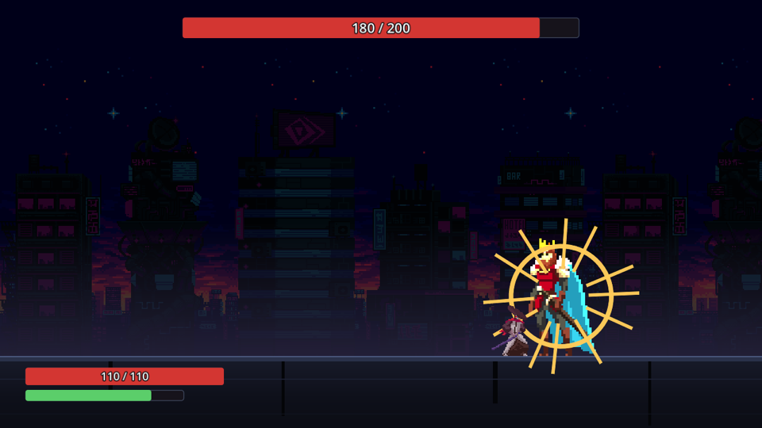
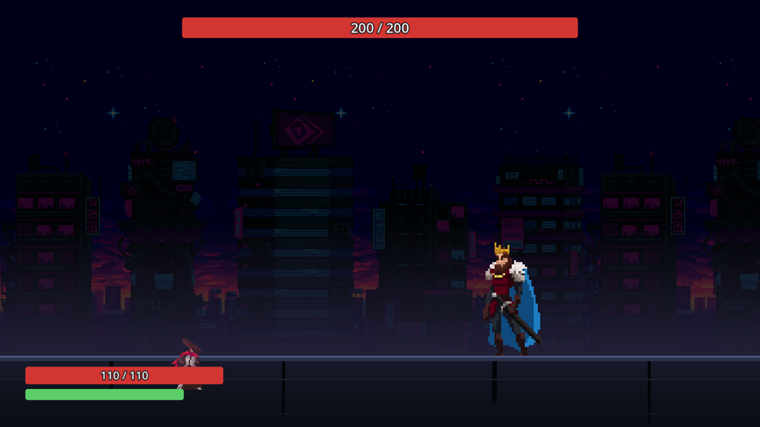
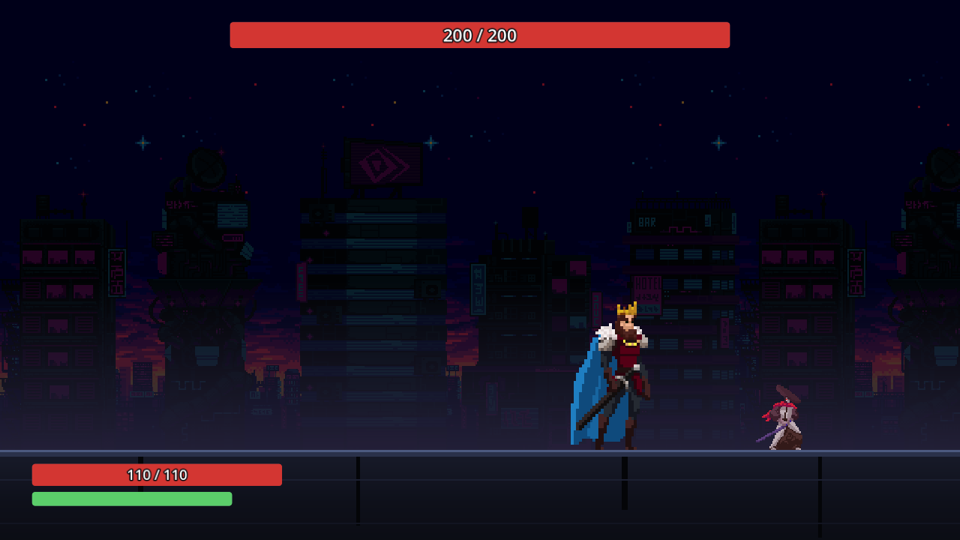
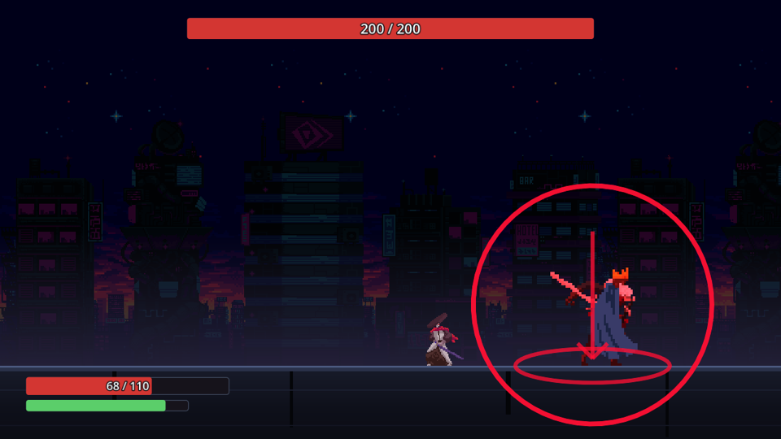
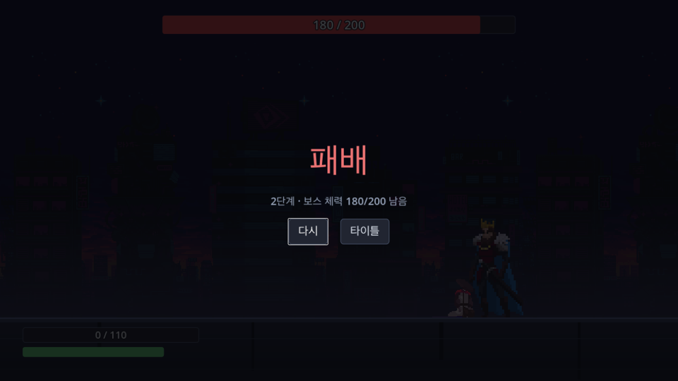
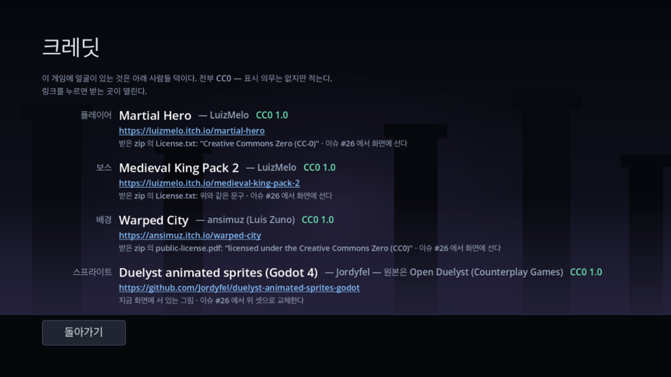

# OVERFIT

**보스 하나를 다섯 번 잡는 2D 가로 소울라이크.** 단계를 넘을 때마다 보스가 쓰는 패턴이 늘고,
그 패턴은 **이 플레이어가 지금까지 어떻게 피했는지에 따라 정해진다** — 그 선택을 신경망이 한다.

이 저장소의 주장은 하나다. **딥러닝이 장식이 아니라 부품이어야 한다.**
"AI 를 썼다"고 적을 자리를 만드는 것이 아니라, 망을 빼면 게임이 성립하지 않는 자리에 둔다.

> ## 🚧 아직 만드는 중이다
>
> **완성된 게임이 아니라 개발 중인 프로토타입이다.** 전투 한 판은 처음부터 끝까지 돌아가지만,
> 이 프로젝트의 핵심인 **"보스가 당신에게 맞춰진다" 는 아직 없다** — 패턴은 지금 무작위로 고른다
> ([왜 일부러 무작위인지](#그래서-지금-패턴-선택이-무작위다)).
>
> | 되는 것 | 아직 안 되는 것 |
> |---|---|
> | 이동 · 점프 · 대시 · 2단계 패리 · 공격 | **딥러닝 패턴 선택** — 이 저장소의 목적 그 자체 |
> | 백장의 패턴 셋, 패턴별 예고, 히트 판정 | 보스가 하나 · 패턴이 셋 (4~5단계는 3단계와 같다) |
> | 승패 · 결과 화면 · 단계 진행 | 캐릭터 3택 · 스탯 강화 (이슈 #22 로 뺐다) |
> | 회피 계측 10축, 헤드리스 전투 · 리플레이 골든 | 사운드 · 음악 |
> | macOS 빌드 | 윈도우 · 리눅스 빌드 |
>
> 지금 시점의 빌드는 **[Releases](https://github.com/Atralupus/OVERFIT/releases/latest)** 에 있다.
> 서명하지 않은 빌드라 처음 열 때 우클릭 → 열기 가 필요하다.

| | |
|---|---|
|  |  |
| **타이틀** — 조작 안내는 손으로 안 적는다. `InputMap` 에서 뽑아 그 자리에서 짓는다 | **전투** — 평평한 보스방 하나. 위가 보스 체력, 아래가 내 체력(빨강)과 스태미나(초록) |

---

## 이 게임에서 가장 중요한 것 — **예고가 서로 다르게 읽힌다**

보스의 선딜 링은 "뭔가 온다" 까지만 말한다. 그것만으로는 세 패턴이 플레이어에게 **같은 공격**이다.
나인 솔즈의 백장이 가르치는 것은 그게 아니라 **칼이 지금 땅에 있나 떠 있나**이고,
그 차이가 화면에 없으면 배울 것이 없다. 그래서 패턴마다 예고 모양이 다르다.

|  |  |  |
|---|---|---|
| **칼이 땅에 끌린다** — 바닥에 붙은 선과 긁힌 자국. `내려찍기 3연` 이다 | **칼을 땅에서 떼어 뒤로 뻗었다** — 점선이 그 칼끝에서 땅까지 내려온다. `이단 올려베기` 다 | **붉다** — 크림슨은 패리가 안 통한다. 아래 화살표와 **발밑의 빈 주머니**가 답을 같이 알려준다 |
| 상단 340px 라 못 넘고, 안쪽에 빈 곳도 없다 → **패리 말고 답이 없다** | 상단 150px 뿐 → 패리해도 되고 **뛰어넘어도 된다.** 셋 중 답이 여럿인 유일한 패턴 | 공중 판정과 착지 충격 둘 → **대시로 빠지거나, 보스 발밑으로 파고든다** |

세 장의 링은 색 말고는 같다. **다른 것은 그 안의 모양**이고, 그것이 이 보스전의 전부다.

| | |
|---|---|
|  |  |
| **맞았다는 것이 보인다** — 흰 실루엣은 셰이더가 아니라 팩 작가가 그린 `Take Hit - white silhouette` 다. 몸 모양이 정확히 맞는다 | **크림슨과 호박색이 한 화면에** — "붉은가" 만으로는 부족하다. 평소 예고와 견줄 수 있어야 그 색이 일한다 |

---

## 무슨 게임인가

화면은 **평평한 보스방 하나**다. 발판도 지형 기물도 없다 — 지형이 조용해야 패턴을 읽는 데 집중된다.
보스는 플레이어의 약 2.3배 크기로 서고(그려지는 키 297px 대 130px), **몸은 서로 통과한다.**
밀어내지 않는 이유는 갇히지 않기 위해서다 — 그 대신 "거리"는 벽이 아니라
**패턴의 안전 구역**이 만든다(`점프 강타` 의 발밑 주머니).

몸이 통과하니 **반대편으로 돌아갈 수 있다.** 그래서 보스는 플레이어를 바라보고 돌아선다 —
다만 **휘두르는 중에는 안 돈다.**

|  |  |  |
|---|---|---|
| 왼쪽에 서면 왼쪽을 본다 | 지나가서 오른쪽에 서면 돌아선다 | **선딜 중에는 안 돈다** — 뒤로 빠져나가도 칼은 원래 방향 그대로다 |

돌아서는 것보다 **안 돌아서는 것**이 중요하다. 스윙 도중에 따라 돌면 예고가 거짓말이 되고,
예고는 이 게임에서 패리를 가르치는 유일한 수단이다.

### 조작

| | 키 | |
|---|---|---|
| **이동** | ← → (A D) | |
| **점프** | Space | 정점 약 300px — 선 몸통(120px)의 2.5배, 보스 키와 거의 같다. **낮은 판정을 넘는 것이 전부**이고 보스를 넘는 수단이 아니다 |
| **대시** | Shift | 한 번에 367px 나간다(중검 기준). 보스 몸 하나를 확실히 지나는 거리이고, 그 동안 무적이다 |
| **패리** | F | 제자리에서 받아친다. 아래 셋으로 갈린다 |
| **공격** | J | 보스가 굳은 틈에 넣는다 |

### 패리는 성공/실패가 아니라 셋이다

| | 창 | 결과 |
|---|---|---|
| **정확** | 적중 **0.133초** 전 이내 | 피해 0 · 보스 0.5초 경직 · **공중 대시 즉시 회복** |
| **부정확** | 적중 **0.133 ~ 0.5초** 전 | 피해의 **절반을 내상**으로 · 지상이면 **0.6초 굳는다** |
| 무반응 | 그 밖 | 그냥 맞는다 |

**연타는 벌을 받는다.** 공격이 안 오는데 앞 누름의 부정확 창 안에서 또 누르면
두 번째는 정확 창이 0.1초로 줄고, 세 번째부터는 아예 없다(부정확만 된다).
받아낸 누름은 사슬을 푼다.

이 셋은 게임성 이전에 **계측의 문제**다. 이분법이던 때는 "늦게 눌렀다" 와 "아무것도 안 했다" 가
같은 점이었다. 중간 단계가 생기자 셋이 세 점으로 갈린다 — 그리고 매 틱 난사하는 봇이
난사로 공짜 성능을 얻지 못해야 학습 데이터가 "노리고 눌렀다"는 기록이 된다.

### 보스 — 백장(Baichang)

나인 솔즈의 첫 미니보스를 레퍼런스로 삼았다. **패리와 대시를 가르치려고 설계된 튜토리얼 보스**라,
지금 이 프로토타입이 필요한 것과 정확히 같다. **패턴이 셋뿐인 것이 설계다** — 셋의 역할이 겹치지 않는다.

| 패턴 | 답 | 왜 |
|---|---|---|
| **내려찍기 3연** | **패리만** | 판정 상단 340px 라 정점 300px 로 못 넘고, 안쪽 안전지대도 없다. 대시 창은 0.12초로 가장 좁고, 세 번을 전부 대시로 넘기면 스태미나가 바닥난다 |
| **이단 올려베기** | 패리 · 점프 · 대시 | 첫 판정까지 0.90초로 가장 느리다. 상단이 150px 뿐이라 보스의 "올려베기"는 그의 무릎~허리 높이를 쓸고, 뜬 몸은 그 위에 있다 |
| **점프 강타** | **패리 빼고 전부** | 크림슨이라 패리가 안 통한다. 내리꽂는 몸은 **공중에서만** 맞고(지상 몸통보다 높다), 착지 충격은 보스 발밑 190px 가 비어 있다 |

`점프 강타` 는 "점프로 피한다"는 습관을 정확히 그 자리에서 벌하고, 동시에
"붙어야 안전하다"는 거리 판단을 1단계부터 만든다.

단계가 오르면 쓰는 패턴이 는다 — 1단계 둘, 2단계 셋. **거기서 끝이다.**
설계상 5단계는 `2·3·5·7·10` 인데 패턴이 셋뿐이라 3~5단계가 모자라고,
그 사실을 감추지 않는다. 명부가 모자라면 매 판 로그에 `[stage][W] short stage=N` 이 남는다.
줄여서 맞춰 놓으면 "단계가 올라도 왜 안 어려워지지"를 나중에 찾을 수 없다.



---

## 보스가 당신에게 맞춰진다 (아직 없다 — 이게 목표다)

5단계에 걸쳐 보스가 쓰는 패턴 수가 는다. 그 패턴을 **무작위로 고르지 않는 것**이 목표다 —
지금까지 당신이 무엇으로 피했는지를 보고 고른다.

목적은 "못하는 걸 더 주기"가 아니라 **잘하는 걸 막기**다.

```
관측: 패리 의존도 0.8 · 대시는 항상 밖으로

다음 보스:
  · 패리 불가 패턴 ×2
  · 안으로 파고들어야만 피해지는 패턴
  · 그리고 확실히 넘을 수 있는 것 하나   ← 숨통
```

손에 익은 것을 빼앗되(**의존 봉인**), 매 단계 **확실히 넘을 수 있는 패턴을 하나 보장한다**(**숨통 보장**).
전부가 낯선 방어전이면 배울 여유가 없어 그냥 불합리하게 느껴진다.
보장된 하나가 "내가 늘었다"를 확인시켜 준다.

실패율이 높은 축을 더 요구하는 **약점 저격은 하지 않는다** — 데스 스파이럴이 되고 초보자일수록 가혹해진다.

한 번 생성된 보스의 패턴은 **고정이다.** 재시도해도 안 바뀐다.
덕분에 선택이 단계 사이에 한 번만 일어나고, 실시간 추론이 없다.

---

## 딥러닝을 어디에 쓰나

### 문제: 데이터가 없다

"이 플레이어에게 어떤 패턴이 어려운가"를 학습하려면 관측이 있어야 하는데,
한 런에서 나오는 회피 관측은 **150건쯤**이다(단계당 5회 시도 × 패턴 10회 노출 × 3단계).
그 수로는 아무것도 학습할 수 없다.

허깅페이스에도 쓸 모델이 없다 — 플레이어 모델의 입력은 **그 게임의 회피 계측값**이라
남의 게임에서 학습된 가중치는 옮겨올 대상 자체가 없다.

### 해법: 데이터를 직접 만든다

```
① 시뮬레이션 봇        대시 타이밍 편향 · 패리 성향 · 욕심 · 거리 성향을
                       파라미터로 가진 봇을 수백만 개 샘플링한다

② 헤드리스 전투로 라벨링   실제 전투 규칙을 창 없이 돌려 "이 봇이 이 패턴에
                       맞았는가" 를 기록한다          ← 데이터 공장

③ 망 학습 (Python)     f(플레이어 잠재, 캐릭터, 패턴 태그) → 피격 확률
                       샘플이 수백만이라 MLP 를 쓸 근거가 있다

④ 런타임 추론 (C#)     수십~수백 건의 실제 관측으로 그 사람의 잠재 벡터만 추정
                       → 망으로 패턴 전부를 점수 매겨 상위 k 선택
```

**④가 핵심이다.** "무엇이 어떤 플레이어에게 어려운가" 라는 무거운 질문은 망이 오프라인에서 푼다.
런타임은 "이 사람이 어떤 유형인가" 라는 저차원 문제만 푼다.

그리고 **②가 이 저장소의 구조 그 자체다.** 사람과 봇이 같은 `InputFrame` 으로 같은 전투를 타는 것도,
규칙 층이 Godot 을 모르고 `Random` 도 벽시계도 없는 것도 전부 여기서 나왔다 —
봇이 별도 경로를 타면 망은 "봇 전용 전투"를 배우고, 그건 사람에게 아무 의미가 없다.
결정론 커널과 헤드리스 루프는 원래 테스트용인데, 그것이 그대로 학습 데이터 생성기가 된다.

### 그래서 지금 패턴 선택이 무작위다

일부러다. 자리는 하나다 — `BattleSim.Begin()` 의 한 줄이 시드·도메인·뽑은 횟수로 좌표를 조회한다.
망이 나중에 **그 한 줄을 갈아끼우고**, 지금의 무작위가 **대조군이 된다.**
같은 시드·같은 플레이어에게 무작위 보스와 망 보스를 붙여 피격률을 비교하는 것 말고
망이 정말 일하는지 증명할 방법이 없다.

### 알고 있는 위험

**sim-to-real 간극.** 망은 "내 시뮬레이션 봇이 어떻게 실패하는가" 를 배우지
"사람이 어떻게 실패하는가" 를 배우지 않는다. 이 접근의 유일한 진짜 위험이라
봇 파라미터 공간을 넓게 잡고, 사람의 실제 플레이로 망의 예측이 실제와 상관이 있는지
**검증하는 단계를 계획에 넣어 뒀다.**

---

## 지금 어디까지 돼 있나

독립된 subsystem 이 일곱이고, **딥러닝은 마지막이다** — 봇을 돌릴 전투가 없으면 학습 데이터를 만들 수 없다.

| | | 상태 |
|---|---|---|
| 1 | 전투 코어 — 이동·점프·대시·패리, 보스 패턴 실행, 히트 판정 | ✅ |
| 2 | 패턴 시스템 — 정의 형식, 태그, 등록표 | ✅ |
| 3 | 계측 — 회피 이벤트 → 플레이어 10축 | ✅ |
| 4 | 성장 루프 — 캐릭터 3택 · 강화 3택 · 단계 진행 | ⬜ |
| 5 | 시뮬레이션 봇 + 데이터 공장 | ⬜ |
| 6 | 망 학습 + C# 배포 | ⬜ |
| 7 | 패턴 선택기 — 의존 봉인 + 숨통 보장 | ⬜ |

1·2·3 은 서로를 너무 많이 알아서 한 덩이([**전투 코어**](https://github.com/Atralupus/OVERFIT/issues/6))로 만들었고, **아홉 태스크 전부 끝났다.**
그 뒤로 보스전을 통째로 다시 세웠다 — 에셋([#26](https://github.com/Atralupus/OVERFIT/issues/26)) ·
조작([#27](https://github.com/Atralupus/OVERFIT/issues/27)) · 백장([#28](https://github.com/Atralupus/OVERFIT/issues/28)).

| | |
|---|---|
| 엔진 | Godot 4.7.2 (Mono / C#) · `forward_plus` · net8.0 · **데스크톱 전용** |
| 화면 | 가로 1920×1080 |
| 규칙 테스트 | Godot 없이 `tools/build.sh test` — **179건**, 0.3초 |
| 에셋 | CC0 팩 셋. 출처는 [`overfit/data/credits.json`](overfit/data/credits.json) 하나 |

---

## 만들면서 지키는 것

**규칙과 그림을 나눈다.** 게임 규칙은 Godot 을 모르는 순수 C# 이고 씬은 그 결과를 그릴 뿐이다.
테스트 프로젝트가 그 파일들을 링크하므로 **"규칙은 Godot 을 모른다"를 컴파일러가 강제한다** —
순수 파일에 `using Godot;` 가 들어오면 즉시 `CS0246` 이다.

**사람과 봇이 같은 전투 코드를 탄다.** 입력이 `InputFrame` 하나로 규칙 층에 들어가고,
씬은 키보드를, 시뮬레이션 봇은 자기 정책을 그 구조체로 바꾼다.
나중에 붙일 수 없는 종류의 결정이라 첫 커밋에 못 박았다.

**수치는 코드가 아니라 데이터에.** [`overfit/data/*.json`](overfit/data) 이 진실이고,
필수 키가 빠지면 부팅이 **빠진 키를 전부 나열하고** 멈춘다.
위 문단들의 숫자는 전부 그 파일에서 온 것이다.

**같은 시드면 같은 결과.** 난수는 "뽑는" 것이 아니라 시드·도메인·키로 **좌표를 조회**하는 것이라
호출 순서가 값에 섞이지 않는다. 규칙 층에는 `Random` 도 벽시계도 없다.
그 커널의 골든 벡터는 파이썬으로 알고리즘을 **따로 구현해** 얻었다 — 같은 코드를 두 번 읽으면 오타도 같이 통과한다.

**손으로 단 것은 기계가 확인한다.** 패턴 태그(`jumpable` · `anti_air` · `parryable` …)는
나중에 망의 입력이 된다. 태그가 타임라인 기하와 어긋나면 망은 거짓을 배우고,
그 실패는 "개인화가 잘 안 되네" 로만 보여 추적할 길이 없다. 그래서 테스트가 실제로 뛰고 대시해서 둘을 대조한다.

**디버깅은 전부 로그로.** 판단이 일어나는 곳마다 왜 그랬는지를 `[tag][레벨] key=value` 로 남기고 레벨로 거른다.
`[E]` 는 규칙 위반이라 헤드리스 판정이 한 줄만 봐도 실패시킨다.

**눈으로 안 봐도 확인된다.** `test` 가 Godot 없이 규칙을 돌리고, `smoke` 가 창 없이 게임을 끝까지 돌린다.

---

## 시작하기

환경 세팅부터 작업 방식까지 **[CONTRIBUTING.md](CONTRIBUTING.md)** 하나에 있다.

```bash
git clone git@github.com:Atralupus/OVERFIT.git
cd OVERFIT
tools/build.sh doctor      # 무엇이 없는지 알려준다
tools/build.sh import      # 클론 직후 반드시 한 번
tools/build.sh test        # 규칙 테스트 — Godot 없이 0.3초
tools/build.sh run         # 실행
tools/build.sh export      # 플레이 가능한 빌드 → out/OVERFIT.app · out/OVERFIT-macos.zip
tools/build.sh shots       # 스크린샷 → out/shots · docs/shots
```

인자 없이 `tools/build.sh` 를 부르면 서브커맨드 전체 목록이 나온다 — **README 보다 그쪽이 최신이다.**

**그림은 저장소에 없다.** 세 팩을 itch.io 에서 **손으로** 받아야 한다 —
itch 는 내려받기에 브라우저 세션이 필요해서 스크립트가 자동으로 못 가져온다. 셋 다 무료다.

```bash
python3 tools/install_assets.py             # ~/Downloads 아래를 뒤져 제자리에 놓는다
python3 tools/install_assets.py --dry-run   # 무엇이 어디로 갈지만 본다
tools/build.sh import                       # ⚠ 그 다음 반드시 한 번
```

받을 곳과 파일 이름은 [`overfit/assets/LICENSES.md`](overfit/assets/LICENSES.md) 에 있다.
스크립트는 푸는 것으로 끝나지 않고 시트에서 `SpriteFrames` 를 다시 만들고,
뷰가 부르는 애니메이션 다섯이 없으면 거기서 멈춘다.

그림 없이도 `tools/build.sh test` 는 전부 돈다 — 규칙은 그림을 모른다.

---

## 문서

| | |
|---|---|
| [CONTRIBUTING.md](CONTRIBUTING.md) | 환경 세팅 · 개발 루프 · 작업 방식 |
| [CLAUDE.md](CLAUDE.md) | 코드 규칙 · 로그 규약 · 검증 절차 (Claude 와 사람이 같이 읽는다) |
| [전투 코어 설계](docs/superpowers/specs/2026-09-22-전투코어-design.md) | 무엇을 왜 그렇게 정했나 |
| [전투 코어 구현 계획](docs/superpowers/plans/2026-09-22-전투코어.md) | 9개 태스크, 전부 TDD |

## 라이선스

**코드와 그림의 라이선스가 다르다.**

| | |
|---|---|
| **코드** (이 저장소가 쓴 것 전부) | [MIT](LICENSE) |
| **그림** (스프라이트 · 배경) | 각 팩의 라이선스 — 지금은 셋 다 **CC0 1.0** |

라이선스 없는 공개 저장소는 **기본적으로 아무 권리도 주지 않는다** — 읽을 수는 있지만 쓰거나 고칠 수는 없다.
그래서 오픈소스라고 말하려면 `LICENSE` 가 있어야 한다. 여기 있는 MIT 는 **코드**에 대한 것이고,
그림에는 미치지 않는다. 그림은 각 팩을 만든 사람의 것이고 그 팩의 라이선스를 따른다.

**출처는 한 곳에만 적는다.** 팩 이름 · 만든 사람 · 링크 · 라이선스 · 그 라이선스를 **어디서 읽었는지**가
[`overfit/data/credits.json`](overfit/data/credits.json) 하나에 있고, 게임의 크레딧 화면과
[`overfit/assets/LICENSES.md`](overfit/assets/LICENSES.md) 가 그 파일을 읽거나 가리킨다.
**이 README 에도 목록을 옮겨 적지 않는다** — 같은 목록을 두 곳에 손으로 적으면 팩이 바뀌는 날
한쪽만 고쳐지고, 그 어긋남은 아무 테스트도 빨갛게 하지 않은 채 라이선스 주장만 거짓이 된다.

아래는 그 파일이 지은 화면이다. 목록이 궁금하면 이 그림이 아니라 **그 JSON 을 보면 된다.**



`license` 는 **받은 zip 안의 라이선스 파일을 읽고** 적는다. 스토어 페이지 문구는 근거로 치지 않는다 —
페이지는 조용히 고쳐지지만 받은 파일 안의 한 줄은 그대로 남는다. 읽은 자리가 각 항목에 적혀 있다.

CC0 는 **저작자 표시 의무가 없다.** 그래도 적는다 — 이 게임에 얼굴이 있는 것이 그 사람들 덕이고, 드는 값이 0 이다.

**에셋 원본(PNG)은 저장소에 넣지 않는다.** CC0 라 재배포해도 되지만 넣지 않는다 —
이유는 권리가 아니라 **저장소 위생**이다. 한 번 들어간 바이너리는 히스토리에서 빠지지 않는다.
받는 법은 [위](#시작하기)에 있다.
