# OVERFIT

**딥러닝을 소울라이크에 접목해 보고, 그게 재미있는지 확인하는 프로젝트다.**

확인하려는 것은 하나다 — **플레이어가 지금까지 어떻게 피해 왔는지를 읽고 공격 패턴이 정해지는 보스**가
상대할 만한가. 재미있는가.

> ### 🚧 아직 개발 중이다
>
> 전투 한 판은 처음부터 끝까지 돌아간다. 하지만 이 프로젝트의 핵심인 **패턴을 고르는 망은 아직 없다** —
> 지금은 무작위로 고른다. 일부러 그렇게 뒀고, 이유는 [아래](#어떤-망을-어떻게-만드나)에 적었다.

---

## 무슨 게임인가

평평한 보스방 하나에서 보스 하나를 잡는 **2D 가로 소울라이크**다. 보스는 **두 단계**다 — 1단계를 이기면 2단계가
서고, 2단계를 이기면 클리어다. 지면 같은 단계를 다시 한다.

보스는 [나인 솔즈](https://ninesols.wiki.gg/)의 튜토리얼 보스 **백장**을 참고했다. 느리고 예측
가능해서, **패리와 대시를 가르치기 위해 설계된 상대**다.

**패턴은 그림에 맞춰 만든다.** 보스 그림의 한 장 한 장이 규칙의 한 단계이고, 칼에 그려진 흰 궤적이 그대로
판정이다 — 보이는 것이 곧 맞는 것이다. 1단계의 패턴은 둘이다.

| | 무엇이 오나 | 답 |
|---|---|---|
| **3연격** | 칼을 든 채 잠깐 멈췄다가(그 자세가 예고다) 세 번 벤다 — 피해 8 · 8 · 14 | 다 된다 — 대시 · 가드 · 패리 · 간격. 점프는 1 · 2타를 거의 어디서든 넘고, 3타는 바짝 붙어 있을 때 넘는다 |
| **점프 공격** | 웅크렸다가 **당신이 선 자리를 향해** 뛰어올라, 착지하며 **바닥 전체**를 친다 — 피해 12. 착지한 발밑에서 **흰 충격파**가 바닥을 따라 양옆으로 퍼진다 — 그 띠의 높이가 곧 맞는 높이다 | 가드와 점프. **패리는 안 받는다** |

**1단계는 당신이 무엇에 기대는지를 재는 자리다.** 2단계는 아직 1단계와 같은 두 패턴으로 돈다 — 1단계의 습관을
겨냥하는 2단계 패턴은 다음 작업이다.

**재시도할 때마다 보스가 달라진다.** 전투가 설 때마다 새 시드가 나와 패턴의 순서가 대개 바뀐다. 지금은 무작위로
고르고, 망이 들어오면 그 자리에서 당신의 기록을 읽는다.

몸은 서로 통과한다. 밀어내지 않으니 갇히지 않고, 대신 "거리"는 벽이 아니라 **패턴의 안전 구역**이 만든다.

**조작** — 이동 `←` `→` (또는 `A` `D`) · 점프 `Space` · 대시 `Shift` · 가드 `↓` (또는 `S`) · 패리 `K` · 공격 `J`

공격은 **2연격**이다. `J` 한 번이 빠른 1타(0.25초)이고, 1타 도중 — 또는 1타가 끝난 뒤 서 있는 동안 — `J` 를 다시 누르면
**2타**가 이어진다: 칼을 크게 세우는 느린 한 방(1초)이고 1타의 세 배를 준다. **휘두른 뒤에는 선다(경직).** 1타만 치고 멈추면
0.4초, 2타까지 휘두르면 0.5초를 칼을 내린 채 가만히 서 있다 — 이어 치는 사람은 1타 뒤에 서지 않으니, 1타만 되풀이하는 것보다
2연격이 세다. 칼질은 그 경직까지 끝까지 커밋이라 도는 동안 아무것도 못 하고, 맞아도 안 끊긴다. 칼은 그림에 그려진 흰 궤적
그대로 닿는다.

**대시**는 0.18초에 보스 몸을 한 번에 지나고, 앞 0.14초는 무적이다. 끝나면 **0.1초** 동안 그 자리에 선다(경직) — 그동안은
아무것도 못 하고 맞으면 그대로 맞는다.

**가드와 패리는 다른 행동이다.** `↓` 를 누르고 있는 동안이 가드다 — 못 움직이고, 피해의 1/4 만 받고 값은
스태미나로 낸다(무거운 한 방이 가드를 깬다 — 깨지면 전액을 맞고 탈진한다). `K` 는 패리다 — 누르면 0.33초 동안 칼을
세우고, 그 앞 **0.133초** 안에 온 판정을 받아친다(피해 0). 창을 놓치면 **그냥 맞는다.** 커밋이 끝나도 **0.25초** 더
칼을 세운 채 선다(경직) — 헛친 패리 한 번은 0.58초 동안 아무것도 못 하게 묶는다. 받아쳤으면 남은 커밋도 경직도
기다리지 않는다 — `J` 가 곧장 반격의 1타로 나간다.

**스태미나를 다 쓰면 탈진한다.** 칼질 · 대시 · 패리는 스태미나를 쓴다. 조금이라도 남아 있으면 값보다 모자라도
**마지막 한 번**은 나가고(0 까지 쓴다), 그 행동이 경직까지 끝나는 순간 **1.1초** 탈진한다 — 맞은 자세로 굳어 움직이지도
막지도 못한다. 가드로 막다가 스태미나가 바닥나도, 가드가 깨져도 같은 탈진이다. 1.1초는 3연격의 2타에서 3타까지다 —
2타에 무너진 사람은 3타를 그대로 맞는다.

**어느 타든 받아치면 보스가 무너진다.** 하던 연격이 그 자리에서 끊기고(남은 타격은 안 온다) 보스가 **1.5초**
탈진한다 — 맞은 자세로 굳은 채 푸르게 선다. 곧장 누른 2연격이 닿기까지(약 1.1초)가 그 안에 들어간다.
"버티다가 → 받아치고 → 제일 센 걸 꽂는다" 가 한 동작으로 이어지는 것이 이 게임의 고리다. 무너지는 순간 화면이
잠깐 멈추는데, 그동안 누른 키는 버려지지 않고 멈춤이 풀리자마자 나간다.

**때려서도 무너뜨린다.** 보스는 맞아도 하던 공격을 멈추지 않는다 — 희게 번쩍일 뿐이다. 대신 칼이 닿을 때마다
보스 체력바 밑의 **경직 게이지**가 찬다(1타 10 · 2타 45 · 끝 100). 2연격 한 번이면 반쯤(55) 차고, 연달아 두 번이면
두 번째 2타에 받아쳤을 때와 똑같이 무너진다. 다만 무너뜨린 2타의 경직을 서야 다음 칼이 나가서 그 탈진에는 1타 한 번이
들어간다 — 받아쳐 무너뜨린 쪽(2연격)이 더 크다. 무너지면 — 받아쳐 무너져도 — 게이지는 비고, 탈진 동안 넣은 칼은
피해만 준다. 받아친 뒤의 반격 2연격도 게이지를 쌓지 않는다 — 게이지는 탈진이 풀린 뒤부터 다시 찬다. 마지막으로
맞은 뒤 1.2초가 지나면 서서히 준다. 공중에서 무너지면 착지하며 치던 칼은 안 오고 그 자리에 내린다 — 받아칠 수
없는 점프 공격을 멈추는 길은 게이지뿐이다.

---

## 화면

**예고는 보스의 그림이다.** 3연격은 칼을 든 장에, 점프 공격은 웅크린 장에 잠깐 멈춰 선다 — 무엇이 오는지도
언제 오는지도 그 자세가 말한다. 보스의 공격에는 동그라미를 그리지 않는다. 1단계에는 가드로 못 막는 판정이 없다 —
옛 변종의 표지와 빨간 마무리(危)는 변종과 같이 걷었다.

**점프 공격의 착지는 흰 충격파다.** 착지의 판정은 칼 궤적이 아니라 바닥의 띠라서, 그 띠를 그린다 — 착지하는 순간 맞는
자리 전체(바닥의 낮은 곳)가 옅게 하얘지고, 그 위로 밝은 앞머리 둘이 발밑에서 양옆 끝까지 달린다. 띠의 높이는 규칙이 치는 판정의
높이 그대로라, 보이는 띠 위로 뛴 발은 안 맞는다.

|  | 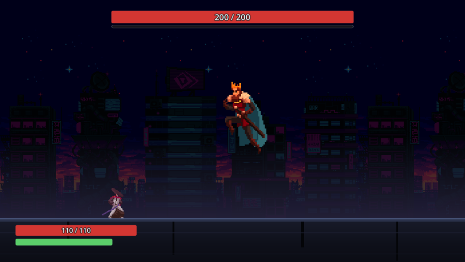 |
|---|---|
| 보스의 선딜 — 그 패턴의 예고 자세에 멈춰 선다 | 점프 공격 — 당신 쪽으로 뛰어 착지에 바닥 전체를 친다 |
| 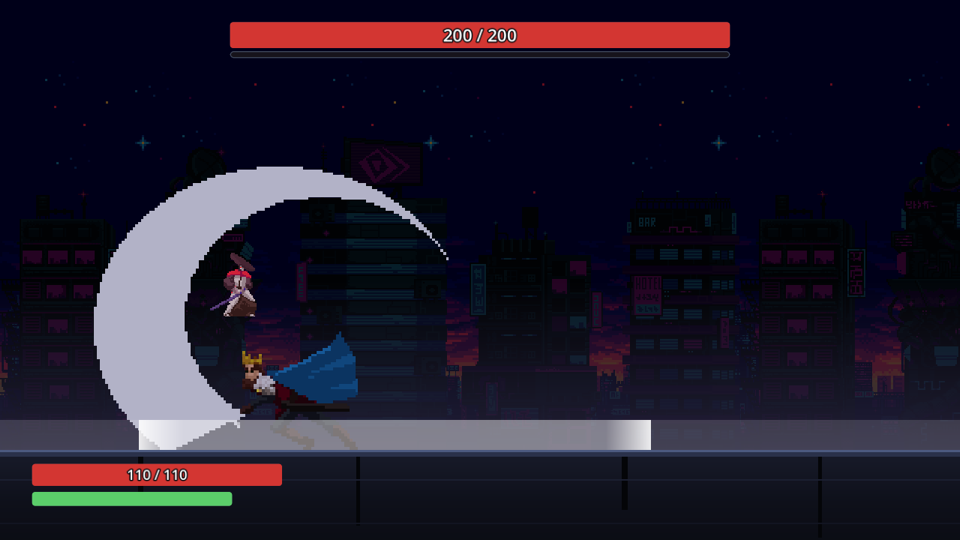 | 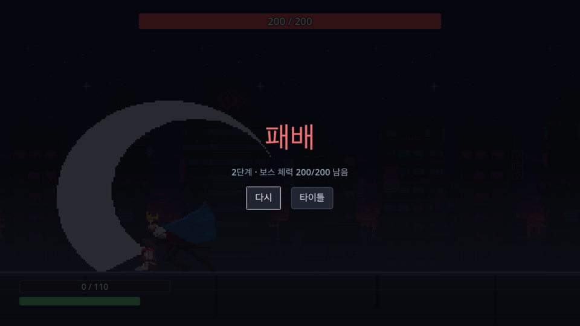 |
| 착지 — 맞는 자리 전체가 옅게 깔리고, 밝은 앞머리 둘이 발밑에서 양옆으로 반쯤 달려 나갔다. 띠의 높이가 곧 맞는 높이라, 뛰어오른 파이터는 그 위에 떠 있다 | 2단계의 결과 화면 — 1단계를 이기면 2단계가 선다 |
| 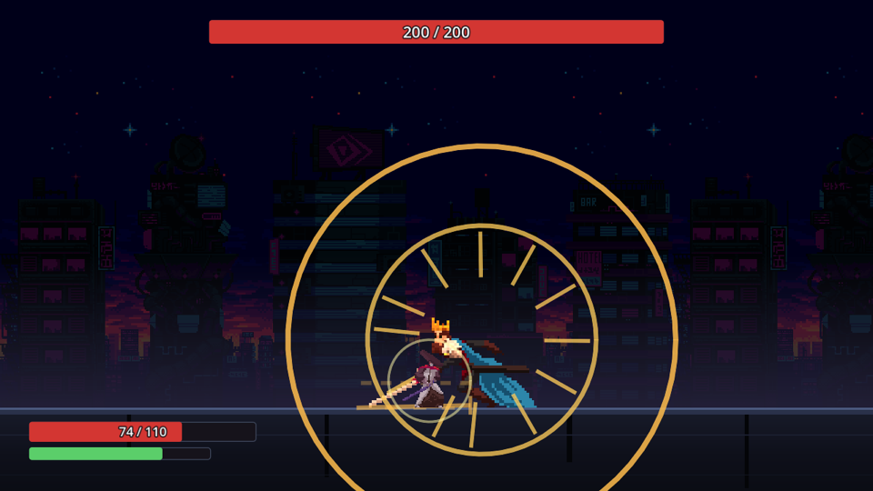 | 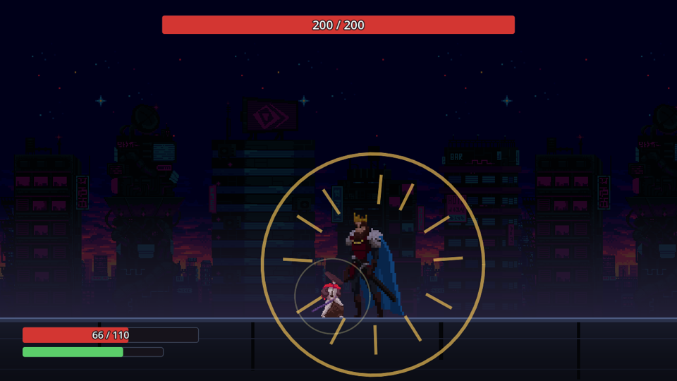 |
| 받아친 순간 | 받아쳐 무너진 보스 — 1.5초 동안 푸르게 서고, 체력바 밑 게이지 자리가 남은 탈진을 파랗게 그린다 |
| 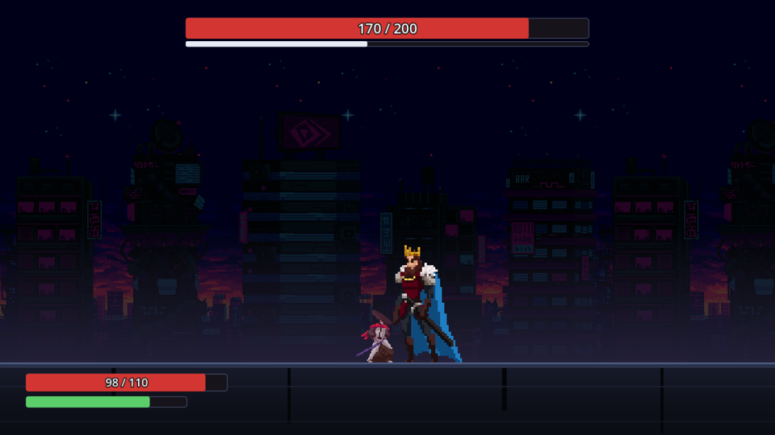 | 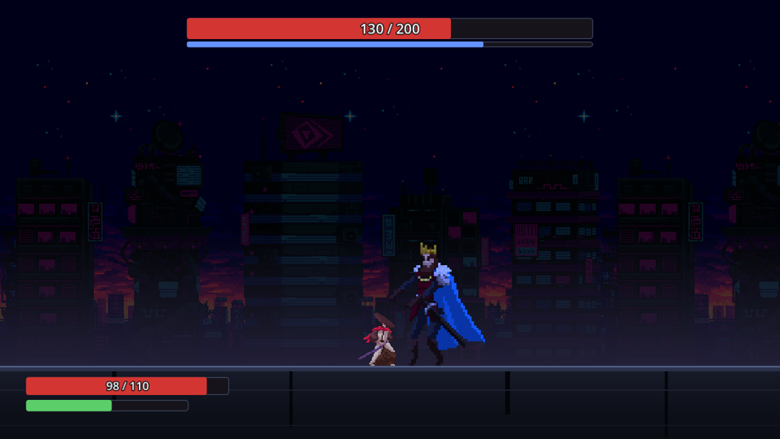 |
| 경직 게이지 — 2연격 한 번에 반쯤 찬다 | 패리 없이 게이지로 무너진 보스 — 받아쳤을 때와 같은 탈진이다 |
| 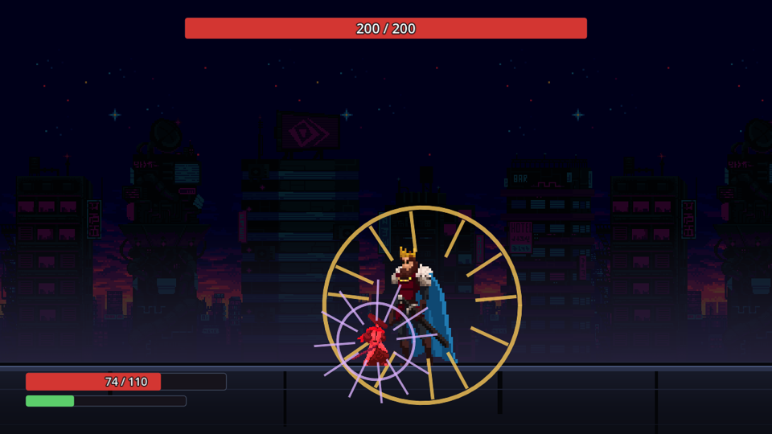 | 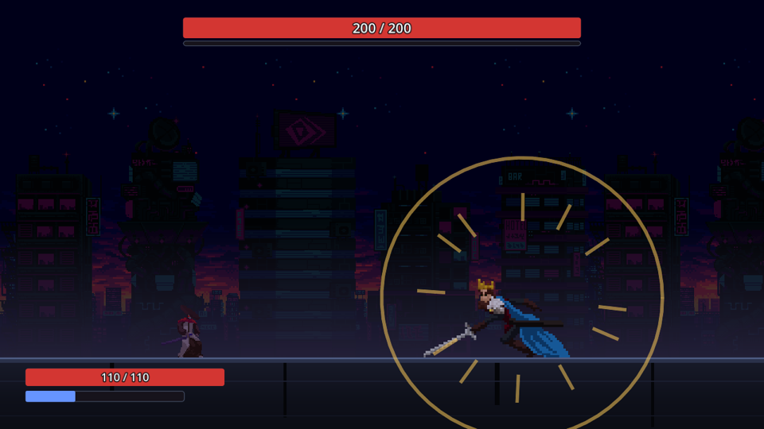 |
| 붙든 가드 — 스태미나가 바닥나 깨진 순간 | 스태미나를 다 써 탈진한 파이터 — 굳은 채 스태미나 바가 파랗다 |

| | |
|---|---|
|  |  |
| 타이틀 | 위가 보스 체력과 경직 게이지, 아래가 내 체력과 스태미나 |
|  |  |
| 공격 | 칼을 든 채 맞은 보스 — 공격 자세 그대로 희게 번쩍인다 |
| 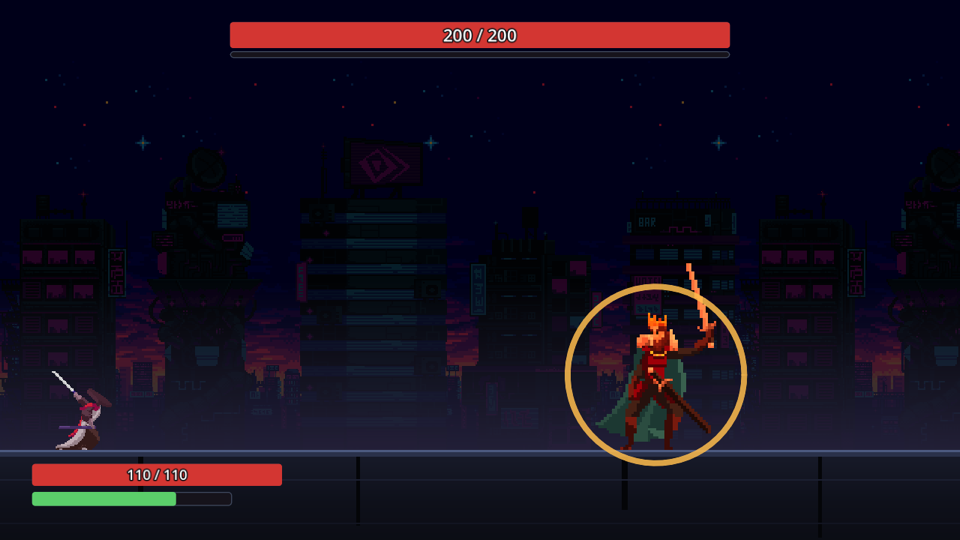 | 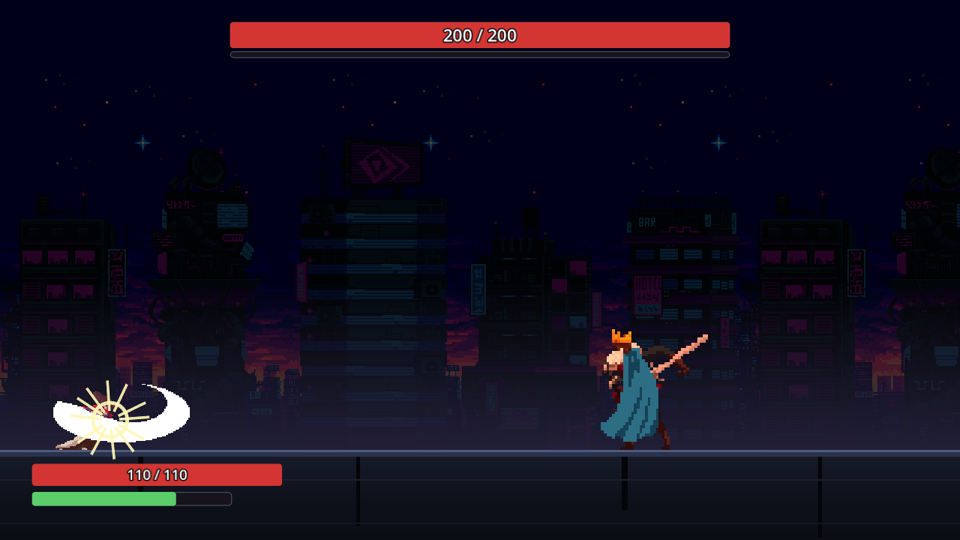 |
| 2타 — 반속으로 칼을 크게 세운다 | 2타의 칼 — 1타의 세 배 |

---

## 해보기

**[Releases](https://github.com/Atralupus/OVERFIT/releases/latest)** 에 macOS 빌드가 있다.
서명하지 않은 빌드라 처음 열 때 막히면 시스템 설정 → 개인정보 보호 및 보안 맨 아래에서 그래도 열기 를 누른다(macOS 14 이하는 우클릭 → 열기).

소스에서 돌리려면 Godot 4.7 (mono) 과 .NET 8 이 필요하다.

```bash
python3 tools/install_assets.py    # 그림은 저장소에 없다 — 받아둔 zip 에서 푼다
tools/build.sh run
```

재시도마다 보스의 순서가 바뀐다. 한 판을 다시 보려면 게임 로그의 `[run][I] attempt=… stage=S seed=X` 를
헤드리스 데모에 넘긴다 — `EXTRA=--stage=S tools/build.sh demo X` 가 그 시도의 보스 순서로 봇 한 판을 돈다.

---

## 어떤 망을 어떻게 만드나

### 망이 답하는 질문

> **이 플레이어에게 이 패턴을 내면, 맞을 확률이 얼마인가?**

그것 하나다. "무슨 패턴을 낼까" 를 망이 직접 정하지 않는다. 망은 **난이도만 예측**하고,
그 예측을 보고 패턴을 고르는 건 규칙이 한다. 이렇게 나눠야 망이 이상한 값을 내도 게임이 안 깨진다.

### 입력

**① 플레이어 잠재 벡터** — 회피 관측에서 뽑은 10개 숫자다. 사람이 손으로 정의했고, 망이 배우는 건
이 축들이 아니라 **이 사람이 이 축들의 어디쯤에 있는가** 뿐이다.

| | |
|---|---|
| `dash_timing_bias` · `dash_timing_var` | 대시를 이르게 누르나 늦게 누르나, 얼마나 들쭉날쭉한가 |
| `dash_direction_bias` | 안으로 파고드나 밖으로 도망가나 |
| `jump_timing_bias` | 점프 타이밍 편향 |
| `jump_reliance` · `parry_reliance` | **다른 수단도 있었는데** 그걸 골랐나. 단순 사용 비율이 아니다 — 그러면 "의존한다" 와 "그것밖에 답이 없는 패턴만 만났다" 가 같은 값이 된다 |
| `airborne_at_impact` | 판정이 서는 순간 공중에 있던 비율 |
| `parry_rate` | 패리 성공률 — 누른 것 중 창 안에 든 비율 |
| `greed` | 위험한데도 공격을 욕심내나 |
| `distance_bias` | 붙어서 싸우나 떨어져서 싸우나 |

축마다 **몇 건의 근거로 나온 값인지**를 같이 싣는다. "3건으로 낸 0.5" 와 "300건으로 낸 0.5" 는 다르고,
망이 그 차이를 알아야 한다.

> 점프와 관련된 축 셋(`jump_reliance` · `jump_timing_bias` · `airborne_at_impact`)은 이제 근거가 선다 —
> 3연격의 1타와 점프 공격의 착지는 점프로 넘는다. "점프로 넘을 수 있었나" 는 패턴의 태그가 아니라 **판정마다**
> 그 모양과 캐릭터의 점프로 잰다: 3연격은 태그로는 "넘을 수 있다" 이지만 2 · 3타는 칼이 점프보다 높다.

**② 패턴 태그** — 패턴마다 손으로 적어둔 성질이다. 패리 가능 여부와 그 창, 대시 창과 방향, 뛰어넘을 수
있는지, 대공인지, 욕심을 벌하는지, 사거리, 다단히트 수, 추적 여부.

**③ 캐릭터** — 지금은 1종이라 상수다. 축은 남겨 뒀다.

### 왜 직접 만들어야 하나

한 런에서 나오는 회피 관측은 **150건쯤**이다. 그 수로는 아무것도 학습할 수 없다.
허깅페이스에 가져다 쓸 모델도 없다 — 플레이어 모델의 입력은 **그 게임의 회피 계측값**이라
남의 게임에서 학습된 가중치는 옮겨올 대상 자체가 없다.

그래서 데이터를 직접 만든다.

```
① 봇을 수백만 개 뽑는다     대시 타이밍 편향 · 패리 성향 · 욕심 · 거리 성향을
                            파라미터로 가진 가짜 플레이어

② 헤드리스로 전투를 돌린다   창 없이 실제 전투 규칙 그대로. "이 봇이 이 패턴에
                            맞았는가" 가 라벨이 된다            ← 데이터 공장

③ 망을 학습한다 (Python)     f(플레이어 잠재, 캐릭터, 패턴 태그) → 피격 확률
                            샘플이 수백만이라 MLP 를 쓸 근거가 있다

④ 런타임 추론 (C#)          실제 관측 수십~수백 건으로 그 사람의 잠재 벡터만 추정한다
```

**④가 핵심이다.** "무엇이 누구에게 어려운가" 라는 무거운 질문은 망이 오프라인에서 푼다.
게임 안에서는 "이 사람이 어떤 유형인가" 라는 저차원 문제만 푼다.

**②는 이 저장소의 구조 그 자체다.** 사람과 봇이 같은 입력 통로로 같은 전투를 타는 것도,
규칙 층이 Godot 을 모르고 난수도 벽시계도 없는 것도 전부 여기서 나왔다 — 봇이 다른 경로를 타면
망은 "봇 전용 전투" 를 배우고, 그건 사람에게 아무 의미가 없다.

### 그 예측으로 보스를 어떻게 정하나

2단계에서 **후보 패턴 전부를 망으로 점수 매기고**, 두 규칙으로 고른다. 읽는 것은 1단계의 기록과 2단계를
다시 한 기록이다.

```
관측: 대시로만 피한다

다음 보스:
  · 1타 → 잡기  ← 대시의 무적을 안 받는 잡기 (2단계 패턴 — 다음 작업)
  · 그리고 아직 안 막힌 것 하나          ← 숨통
```

**의존 봉인** — 손에 익은 것을 빼앗는다. 목적은 "못하는 걸 더 주기" 가 아니라 **잘하는 걸 막기**다.

**숨통 보장** — 매 단계 확실히 넘을 수 있는 패턴을 하나 남긴다. 전부가 낯선 방어전이면 배울 여유가
없어 그냥 불합리하게 느껴진다. 보장된 하나가 "내가 늘었다" 를 확인시켜 준다.

실패율이 높은 축을 더 요구하는 **약점 저격은 하지 않는다** — 데스 스파이럴이 되고 초보자일수록 가혹해진다.

고르기는 **시도를 시작할 때 한 번** 세운다. 판 도중에는 안 바뀌고, 지고 다시 하면 그때까지의 기록으로
다시 세운다 — 실시간 추론이 없다.

### 그래서 지금이 무작위다

일부러다. 자리는 고르기 등록표(`stages.json` 의 `picker`)이고, 망은 나중에 **구현을 하나 더한다.** 그러면
지금의 무작위(`uniform`)가 **대조군이 된다** — 같은 플레이어에게 무작위 보스와 망 보스를 붙여 비교하는 것 말고
망이 정말 일하는지 증명할 방법이 없다. 1단계는 망이 들어와도 무작위다 — 당신이 무엇에 기대는지를 재는 자리라서다.

### 알고 있는 위험

**sim-to-real 간극.** 망은 "내 봇이 어떻게 실패하는가" 를 배우지 "사람이 어떻게 실패하는가" 를
배우지 않는다. 이 접근의 유일한 진짜 위험이고, 사람의 실제 플레이로 망의 예측이 실제와 상관이 있는지
검증하는 단계를 계획에 넣어 뒀다.

---

## 라이선스

코드는 [MIT](LICENSE). 그림은 CC0 팩 셋을 쓰며 원본은 저장소에 없다 —
목록은 게임 안 크레딧 화면과 [`overfit/data/credits.json`](overfit/data/credits.json) 에 있다.
