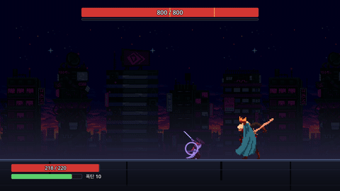
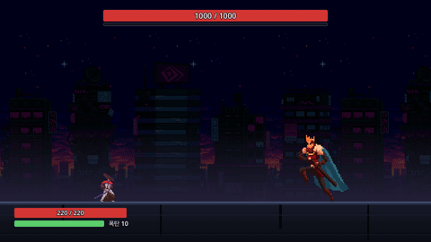
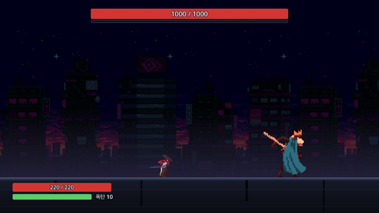
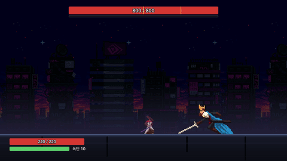
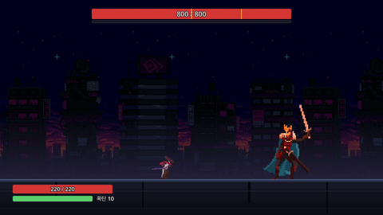
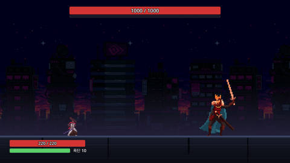
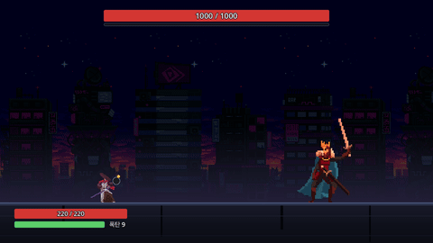

# OVERFIT

[한국어](README.ko.md)

OVERFIT is a 2D side-scrolling soulslike with one boss fight. Before each attack the boss makes a whole plan: how long to rest,
whether to run in, which move to open with, and whether to cancel that move into another one. In this version the boss plans at random,
and when the player throws a bomb, the boss sees it and tries to interrupt the throw. A later version will read the player's habits and
plan against them.

The purpose is to check whether a boss that adapts to the player's habits is fair and fun to fight. This version builds the moves,
the cancels, and the running that the adaptive boss will plan with, plus the player's bombs and a boss that tries to interrupt them.

## Scenes

|  |  |
|---|---|
| **3-hit combo → rush.** Cancelled after the first hit | **3-hit combo → grab.** Cancelled after the second hit; a guard does not stop the grab |
|  |  |
| **Jump attack.** Only a jump clears the landing | **Uppercut.** Hits a player who jumped early to clear the combo |
|  |  |
| **Fast 3-hit combo.** Catches a player still in a 2-hit combo | **Off-beat 3-hit combo.** Catches a parry timed to the normal rhythm |
|  |  |
| **Bomb, interrupted.** The boss cancels at the next cancel point and rushes in before the release | **Bomb, landed.** Thrown as the combo starts, the first cancel point comes too late |

## The fight

- One boss with 1,000 HP. The fighter has 220 HP and one life. A fight that lasts 10 minutes is a loss.
- The fighter can dash (a short invincibility), jump, guard (costs stamina), parry, attack (one or two hits), and throw bombs
  (10 per fight).
- A parry at the right moment stops the boss's move and exhausts the boss for 1.5 seconds. Hits also fill the boss's poise gauge,
  and a full gauge exhausts the boss the same way.

## Moves

Seven moves. Ticks are 1/60 s, counted from the tick the move starts. Each hit stays active for 8 ticks.

| Move | Hits (tick) | Damage | Avoided by | Notes |
|---|---|---|---|---|
| 3-hit combo | 51 · 93 · 159 | 8 · 8 · 14 | dash, guard, parry | A well-timed jump clears the first hit. Cancel points 78 · 144 |
| Off-beat 3-hit combo | 60 · 111 · 186 | 8 · 8 · 14 | dash, guard, parry | Same swings, but each windup is held 0.15 s longer. Catches players who parry by rhythm. Cancel points 87 · 162 |
| Fast 3-hit combo | 24 · 51 · 84 | 8 · 8 · 14 | dash, guard, parry | First hit after 0.4 s. Catches a 2-hit combo started right after the previous move. Cancel points 36 · 69 |
| Rush | 24 after arriving | 14 | dash, guard, parry | Runs at 3,600 px/s to 280 px in front of the player, then hits |
| Grab | 36 | 25, held 1 s | jump only | A white orb flies to the player for 0.6 s first |
| Jump attack | 60 | 24 | jump only | One leap. The landing covers the whole floor; dash invincibility, guard, and parry do not help |
| Uppercut | 51 | 14 | dash, guard, parry | Same timing as the 3-hit combo's first hit, but it reaches high. A player who jumps early to clear the combo is hit |

## Plans

```
rest (in place, turning to face the player) → [run] → first move → [cancel] → follow-up move → next plan
```

- **Rest.** 0.4, 0.8, or 1.2 seconds. The rest belongs to the move after it: after a short rest the fast 3-hit combo catches a 2-hit combo
  pressed during the previous move's recovery, and after a long rest nothing does.
- **Run.** If the plan runs, the boss runs at 840 px/s (twice the fighter's walking speed) to 280 px in front of the player and starts
  the first move when it arrives. It turns to face the player on every tick. If the player is already within 280 px, it does not run.
  A run that lasts more than 3 seconds stops where it is. While resting, the boss stays in place.
- **Cancel.** The three combos have cancel points at the moment the next hit's windup would start. At a cancel point the boss drops
  the rest of the move, turns to face the player, and starts the follow-up move on the same tick, without resting.
  One cancel per plan; the follow-up plays to the end. If the boss is exhausted, the plan ends and the cancel is dropped.
- **Random picking.** Each decision (first move, rest, run, cancel, cancel point, follow-up) uses its own seeded random stream
  (`overfit/core/Det.cs`), so the same seed gives the same boss. Half of the combos are cancelled and half of the plans run
  (`picker` in `overfit/data/balance.json`).
- **Data only.** A move added to `overfit/data/patterns.json` and to the roster in `stages.json` becomes both a first move and a follow-up
  for every cancel point, without code changes. A cancel point added to a move adds a cancel to that move's plans.

## Bombs

- 10 per fight, thrown with L. Bombs cost no stamina; the count is the cost.
- Throwing works only on the ground and commits the fighter: nothing else can be done during the 1.5-second windup, and **a hit before
  the release interrupts the throw and the bomb is lost.** After the release the fighter is stiff for 0.25 seconds.
- A released bomb flies for 0.5 seconds, follows the boss, and lands on it for 60 damage (1.5 times a 2-hit combo). The only defence
  is to interrupt the throw before the release. Bombs do not fill the poise gauge.

## The boss tries to interrupt

The boss sees a throw start and knows about it 0.3 seconds later; a "!" appears above its head. From then on it **always tries to
interrupt, whatever it is doing,** at the nearest chance:

| What the boss is doing | Chance to interrupt |
|---|---|
| Resting, running | The tick it knows |
| A move | The move's next cancel point, even one the plan did not pick |
| A move without cancel points (rush, grab, jump attack, uppercut) | After the move ends |
| Exhausted | After the exhaustion ends |

- When it interrupts, the plan ends, the boss turns toward the thrower, pauses for 0.25 seconds, and rushes. If the rush hits before the
  release, the throw is interrupted. The boss tries even when it will be too late; whether it gets there depends on the distance and the
  cancel points.
- A throw in front of a resting boss is interrupted at any distance. Thrown at random moments from a middle distance (760 px), three bombs
  in four are lost: the boss interrupts 52% and the move it is doing hits the fighter in another 23%.
- **Timing makes bombs land:** right after a cancel point passes (as a 3-hit combo starts, or after its first or second hit), in the
  last 0.3 seconds of a rest (the boss only knows once its next move has started), and right after exhausting the boss with a parry or
  a single hit (a 2-hit combo leaves the fighter stiff for too long). No bomb lands during the moves that close in on the fighter (rush,
  grab, jump attack).
- This boss cannot interrupt "throw as soon as a 3-hit combo starts"; the first cancel point comes too late. Reading such a habit and
  standing ready to interrupt it is the job of the prediction in slice 4. The reaction delay, pause, and move are `bomb_reaction` in
  `overfit/data/bosses.json`. The measurements are in §2.5 of the
  [slice 2 design](docs/superpowers/specs/2026-09-30-조각2-폭탄과-반응-design.md) (Korean).

## Replays

Each finished attempt adds one JSON line to `user://attempts/<session seed>.jsonl`: the plans, the inputs (run-length encoded;
the longest fight is about 27 KB), the dodge events, the bombs (the throw tick, the boss's move at that moment, the outcome — landed,
interrupted by the boss, lost to another hit, or cut short by the end of the fight — and the tick the boss interrupted), and a hash of the
game data. Nothing is uploaded.

- `EXTRA="--history=<file> --attempt=N" tools/build.sh demo` replays an attempt with its saved inputs and compares the plans,
  the length, the result, every dodge event, and every bomb. It logs `replay_match`, `[E] replay_mismatch` (determinism broke),
  or `[W] replay_data_changed` (the game data changed since the attempt).
- Lines written by version 0.9 and earlier have no inputs and cannot be replayed (`[E] replay_no_inputs`). Lines written by 0.10 have
  no bombs, so bombs are not compared for them.
- The result screen shows how the boss planned: the number of plans and cancels, the dodges used in the fight, what happened to the
  bombs, how many times each move appeared and hit, and each cancel pair.

## The adaptive boss

Version 0.9 (tag [`v0.9.2`](https://github.com/Atralupus/OVERFIT/tree/v0.9.2)) had a neural network that predicted,
from the player's stage-1 dodges, how likely the player was to be hit by each stage-2 pattern. It was removed with this version's
move rework, because its outputs were tied to the old patterns. A new network that plans from recent and accumulated habits comes in
slice 4 of the [design](docs/superpowers/specs/2026-09-29-똑똑한-보스-design.md) (Korean).

## Where things are

| Part | Location |
|---|---|
| Moves, cancel points | `overfit/data/patterns.json` |
| Boss numbers (rest, run, bomb reaction) | `overfit/data/bosses.json` |
| Bomb numbers | `overfit/data/fighters.json` (`bomb`) |
| Picker settings | `overfit/data/balance.json` (`picker`) |
| Plans and cancels | `overfit/battle/rules/BossPlan.cs`, `PatternPickers.cs`, `PlanFlow.cs`, `BattleSim.cs` |
| Running | `overfit/battle/rules/BattleSim.cs`, `RushMotion.cs` |
| Bombs, the boss's reaction | `overfit/battle/rules/Fighter.cs`, `Bombs.cs`, `BombWatch.cs`, `BombRecord.cs`, `BattleSim.cs` |
| Attempt log, replay | `overfit/battle/rules/AttemptLog.cs`, `InputTape.cs`, `Replay.cs`, `overfit/battle/debug/BattleDemo.cs` |
| Bot fleet, data factory | `overfit/battle/rules/FleetBot.cs`, `BotTraits.cs`, `tools/factory/` |

## Play

macOS builds are on the [Releases](https://github.com/Atralupus/OVERFIT/releases/latest) page. The build is not signed.
If macOS blocks it, open System Settings → Privacy & Security and choose Open Anyway.

| Action | Key |
|---|---|
| Move | ← → (A D) |
| Jump | Space |
| Dash | Shift |
| Attack | J (press again for a 2-hit combo) |
| Guard | ↓ (S), hold |
| Parry | K |
| Bomb | L |

Building from source needs Godot 4.7 (mono) and .NET 8. See [CONTRIBUTING.md](CONTRIBUTING.md) (Korean).

| Command | What it does |
|---|---|
| `tools/build.sh check` | Format, build, rule tests, `.uid` pairs, hitbox shapes. The commit gate |
| `tools/build.sh smoke` | Boots the game headless and tours the scenes |
| `tools/build.sh demo [seed]` | One headless fight with a bot |
| `tools/build.sh factory` | The bot fleet fights the boss and writes samples |
| `tools/build.sh shots` | Screenshots |
| `tools/build.sh export` | macOS build |

## License

Code: [MIT](LICENSE). Art: three CC0 packs, not included in the repository. The list is in the in-game credits and
[`overfit/data/credits.json`](overfit/data/credits.json).
