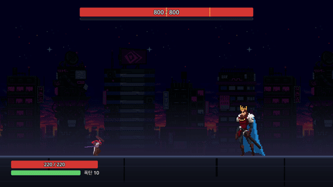
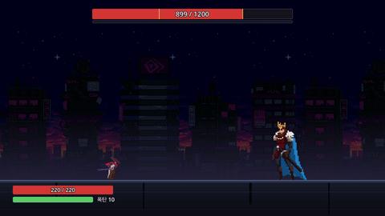
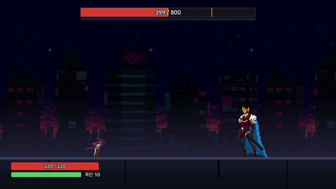
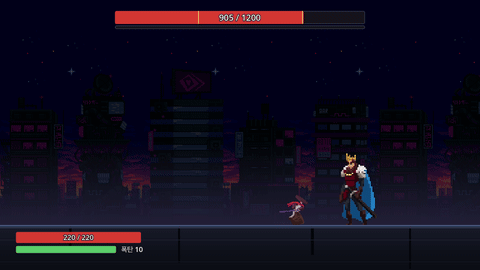

# OVERFIT

[한국어](README.ko.md)

OVERFIT is a 2D side-scrolling action game with one boss fight. The boss is a policy network trained by reinforcement learning, and
its three phases are three checkpoints of the same training run, in order of training: phase 1 is the least trained, phase 3 the most.
Nothing is learned during play; the networks are fixed when the game ships.

- The boss has 800 HP. Phase 2 starts at 600 HP and phase 3 at 400 HP. At each change the boss stands still, flashes white three
  times, and takes no damage for 1.5 seconds; then the next checkpoint takes over.
- The fighter has 220 HP and one life, and can move, jump, dash (short invincibility), guard (costs stamina), attack (one or two hits),
  and throw bombs (10 per fight, 1.5 s windup, 60 damage; a hit before the release loses the bomb). Hits fill the boss's poise
  gauge, and a full gauge exhausts the boss for 1.5 seconds. A fight that lasts 10 minutes is a loss.

|  |  |
|---|---|
| **Phase 1.** Checkpoint from round 10 of 20 | **Phase 2.** Checkpoint from round 16 |
|  |  |
| **Phase 3.** Checkpoint from round 20 | **Phase change** |

## The learning problem

**Decisions.** The boss acts at decision points, not every frame (the game runs at 60 ticks per second):

| Point | When |
|---|---|
| Freed | A move ends, an exhaustion starts, a phase change ends, the fight starts (only "wait" is open) |
| Rest | Every 12 ticks (0.2 s) while waiting |
| Approach | Every 12 ticks while running in, and on arrival |
| Retreat | Every 12 ticks while backing off |
| Cancel | At each cancel point of a combo |

Between decisions the chosen action plays out, so this is a semi-Markov decision process: a decision lasts a variable number of
ticks (its *span*).

**Actions.** One categorical over 13 actions: wait, approach, retreat, leap over, leap back, continue the current move, and the seven
moves (3-hit combo, jump attack, off-beat 3-hit combo, fast 3-hit combo, rush, grab, uppercut). The rules give a mask of legal actions
per decision (for example, "continue" only at a cancel point, "approach" not after arriving), and the policy is a masked softmax.

**Observation.** 95 numbers, normalized to roughly [−1, 1]:

| Part | Size | Contents |
|---|---|---|
| Decision point | 6 | one-hot |
| Boss | 10 | x / arena width, y / 300, facing, HP ratio, phase one-hot (3), poise ratio, exhausted, shifting |
| Boss movement | 4 | none · approach · retreat · leap one-hot |
| Boss move | 10 | none + 7 moves one-hot, move progress, ticks to the next cancel point / 60 |
| Fighter, 0.3 s ago | 13 | dx / arena width, y / 300, facing, facing the boss, HP ratio, stamina, bombs / 10, throw progress, action one-hot (5: idle, dash, attack, guard, throw) |
| Fighter history | 40 | the fighter's action one-hot at 8 samples, 6 ticks apart, over the 0.8 s before that |
| Bombs in flight | 12 | up to 4 × (present, flight progress, origin dx) |

The fighter is observed with an 18-tick (0.3 s) delay, like a human's reaction time; the boss's own state is current. Items are
encoded by their properties, not their names, so new items widen the property columns instead of adding item-specific inputs.

**Reward** for decision *i*, over its span:

```
r_i = (fighter HP lost / 220) − (boss HP lost / 800) − 0.002 · (span ticks / 60)
      + 0.5 / 7   the first time a move is used in the fight
      ± 1         at the end (win / loss; a timeout is a loss)
```

The first-use bonus exists because, without it, the policy dropped dominated moves entirely (the fast 3-hit combo has the same damage
as the 3-hit combo and comes out sooner). With it, every checkpoint used in the game uses all seven moves.

**Discounting by time.** γ = 0.99 is the discount per 12 ticks, and a decision is discounted by γ^(span / 12) (the same for the GAE λ
term). Discounting per decision instead made long actions (a grab holds for a second) look cheaper and biased the policy toward them.

## Network and PPO

- Policy and value are separate MLPs, 95 → 128 → 128 → 13 and 95 → 128 → 128 → 1, ReLU, He initialization. The policy's last layer is
  scaled by 0.01 so the initial policy is close to uniform over legal actions.
- PPO with clipping 0.2, GAE λ 0.95, 4 epochs, minibatch 1,024, Adam with learning rate 3·10⁻⁴, value loss coefficient 0.5, entropy
  coefficient 0.03 (boss) and 0.005 (fighter), gradient norm clipped at 0.5, advantages normalized per minibatch.
- The trainer is plain numpy (`ml/rl/net.py`, `ppo.py`, `train.py`), with hand-written backpropagation and gradient checks in the
  tests.
- Experience is generated by the game's own rules in C#, headless (`tools/factory`, `--rollout`): the same code the game runs, in
  parallel, with episode results independent of the thread count. A rollout writes a flat binary file of
  (observation, mask, action, log-probability, value, reward, done, span) that numpy reads in one call.

## Self-play

Against scripted bots alone, the boss found one exploit (the bots could not escape a grab) and collapsed onto it. So a second network
learns to play the fighter, and the two train in turns.

- **The fighter network** sees itself now and the boss 12 ticks ago (52 numbers, including the boss's current move step and the time
  to its next active hit frame), decides every 6 ticks, and chooses one of 11 actions (idle, left, right, jump ×3, dash ×2, attack,
  guard, bomb). Its reward is the mirror of the boss's, without the time term.
- **Schedule.** 20 rounds. In each round the boss trains for 10 iterations (256 fights each), then the fighter for 10 iterations (128
  fights each). Every round both are saved.
- **Opponent pools.** The boss trains against the bot fleet plus 5 saved fighters (the latest 3 and 2 spread over earlier rounds); the
  fighter trains against the hand-written rule boss plus 5 saved bosses chosen the same way. Training against a pool rather than only
  the latest opponent keeps either side from overfitting to one partner.
- **Training only the boss for more rounds at the end did not work:** it found the last fighter's weakness and used grabs for 75% of
  its moves, beating that fighter but getting weaker against everyone else. Only checkpoints from alternating rounds are used.

## Choosing the three phases

Every saved boss plays the same test set (the bot fleet and the saved fighters of rounds 5, 10, 15, and 20), 256 fights with fixed
seeds. Phase 3 is the strongest checkpoint (round 20, 89%). Phases 1 and 2 are the checkpoints whose win rates are closest to half and
three quarters of the way from the untrained boss (22%) to phase 3: round 10 (63%) and round 16 (71%). Only checkpoints that use every
move for at least 1% of their move choices are candidates.

The last trained fighter beats the phase-3 boss in 61% of 256 fights, so a strong player is expected to win.

## Baselines

512 fights per boss against the same test set, same seeds (`tools/build.sh gate --name=sp-4`, result in
[`ml/rl/gate/sp-4.json`](ml/rl/gate/sp-4.json)):

| Boss | Win rate |
|---|---|
| Uniform random over legal actions | 21% |
| Hand-written rules (the boss before networks: random plans of rest, run, move, cancel) | 23% |
| Tabular Q (Monte Carlo control, same rewards and number of fights) | 55% |
| Phase 1 · 2 · 3 network, whole fight | 65% · 73% · 89% |
| The game's boss (phase 1 → 2 → 3) | 78% |

The tabular baseline discretizes each decision into (decision point, distance in 4 bins, fighter airborne, fighter action, boss move,
phase), about 660 visited states, and was trained against the test set itself. It is far behind the network, which reads all 95
observations at once.

## How the networks run in the game

- The three checkpoints are stored as JSON (`overfit/data/boss_net/form1.json`, `form2.json`, `form3.json`, with their origin in
  `picks.json`) and evaluated in C# with a plain forward pass (`PolicyNet.cs`). The game switches networks when a phase change ends.
- The action is **sampled** from the masked softmax, as in training, not taken greedily. A greedy policy repeats one action and looks
  broken rather than weaker.
- **Deterministic.** Sampling uses the game's seeded, stateless random numbers (`overfit/core/Det.cs`), and the softmax's `exp` is
  computed with additions and multiplications only (`DetMath.Exp`), because the platform's `Math.Exp` may differ in the last bit
  between machines. Every attempt stores its inputs and replays exactly.
- **Checked against Python.** A test feeds fixed observations to the three networks and compares the logits and values from C# with a
  pure-Python forward pass that uses the same summation order, bit for bit.
- The networks are part of the data hash stored with every attempt, so attempts recorded before a network changes are reported as
  "data changed" rather than as a replay failure.

## Play

macOS builds are on the [Releases](https://github.com/Atralupus/OVERFIT/releases/latest) page. The build is not signed.
If macOS blocks it, open System Settings → Privacy & Security and choose Open Anyway.

| Action | Key |
|---|---|
| Move | ← → (A D) |
| Jump | Space |
| Dash | Shift |
| Attack | J (press again for a 2-hit combo) |
| Guard | ↓ (S), hold |
| Bomb | L |

Building from source needs Godot 4.7 (mono) and .NET 8. See [CONTRIBUTING.md](CONTRIBUTING.md) (Korean). Training needs Python with
numpy in `ml/.venv` (`ml/requirements.txt`); the settings are in `ml/rl/train.json`.

| Command | What it does |
|---|---|
| `tools/build.sh check` | Format, build, tests. The commit gate |
| `tools/build.sh export` | macOS build |
| `tools/build.sh selfplay --name=NAME` | Self-play training → `out/selfplay/NAME/` |
| `tools/build.sh evalboss --name=NAME` | Tests every saved boss against the test set |
| `tools/build.sh pick --name=NAME` | Picks the three phases and writes the Python check values |
| `tools/build.sh qtrain --name=NAME` · `gate --name=NAME` | Trains the tabular baseline and runs the comparison |
| `tools/build.sh duel FIGHTER.json` | Records a full fight between a trained fighter and the game's boss |

## License

Code: [MIT](LICENSE). Art: three CC0 packs, not included in the repository. The list is in the in-game credits and
[`overfit/data/credits.json`](overfit/data/credits.json).
